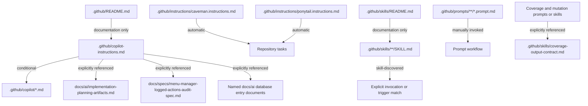

## Executive Summary

Verified major findings after cleanup:

* The broken db-diagram prompt path conflict is resolved.
* The root Copilot instruction file is now narrower and no longer carries duplicated repository-detail rules already owned by routed section files.
* Stale `.github` documentation drift is resolved for OpenSpec claims, deprecated-skill indexing, and the dead parity example path.
* Repeated coverage and mutation output-contract boilerplate now points to the shared owner instead of being copied across prompts and skills.
* The redundant `.github/copilot-coding-standards.md` file has been removed after its remaining unique rule was moved to a verified owner.

Highest-priority remaining correction:

* `AUDIT-002` is only partially resolved because the user explicitly prohibited changes to `.github/instructions/caveman.instructions.md` and `.github/instructions/ponytail.instructions.md`, so the always-on three-layer instruction stack still exists.

Unresolved verification limits:

* `/skills` menu visibility is not verified through the current VS Code Copilot Chat session.
* Automatic loading beyond the attached repository instructions and explicitly invoked skill is not verified through the current VS Code Copilot Chat session.

No fabricated token or AI credit estimates were used in this audit.

## Scope

* Workspace root: `c:/source/lce-menu-admin-api`
* Operating mode: Cleanup mode, followed by a post-cleanup audit rerun
* Included locations:
  * `.github/copilot-instructions.md`
  * `.github/instructions/**/*.instructions.md`
  * `.github/copilot/**/*.md`
  * `.github/skills/**/SKILL.md`
  * `.github/prompts/**/*.prompt.md`
  * `.github/README.md`
  * `.github/skills/README.md`
  * `README.md`
  * `docs/ai/copilot-context-audit.md`
  * `docs/ai/copilot-context-cleanup.md`
* Excluded locations:
  * application source code
  * tests
  * pipelines
  * infrastructure
  * database assets
  * dependencies and build outputs
* Limitations:
  * current workspace contains preexisting deleted agent files under `.github/agents/`
  * current workspace contains preexisting untracked audit-support artifacts
  * cleanup respected the hard boundary not to modify `.github/instructions/*.instructions.md`

## Repository State

* Current branch: `menu-items`
* Existing working-tree changes: yes
* Earlier audit existed: yes

Preexisting repository-state limitations retained during cleanup:

* Deleted in working tree before this cleanup slice:
  * `.github/agents/PostgresExpert.agent.md`
  * `.github/agents/acceptance-tests.agent.md`
  * `.github/agents/aspire-expert-agent.md`
  * `.github/agents/unit-tests.agent.md`
* Untracked before or alongside cleanup:
  * `.copilot-tracking/research/subagents/2026-08-05/`
  * `.github/skills/copilot-context-auditor/`
  * `docs/ai/copilot-context-audit.md`

## Inventory

Shared activation and scope by category:

| Category | Activation | Scope | References | Referenced by | Count |
| --- | --- | --- | --- | --- | ---: |
| Repository instruction | repository entry file | repository-wide | routed section files and named docs | Copilot repo instruction loading | 1 |
| `.instructions.md` files | automatic via `applyTo` | repository-wide | none | VS Code instruction loading | 2 |
| Routed `.github/copilot/*.md` files | conditional via root instruction | task and path scoped | none | `.github/copilot-instructions.md` | 6 |
| Prompt files | manual invocation | task scoped | varies by prompt | none verified | 20 |
| Skill files | skill discovery and explicit invocation | task scoped | varies by skill | none verified beyond explicit invocation of `copilot-context-auditor` | 25 |
| README files in `.github` | documentation only | documentation only | local links and path references | human readers and optional cross-reference | 2 |
| Root `README.md` | documentation only | documentation only | repository docs | human readers | 1 |

Per-file path, byte, line, and disposition inventory for current customization files:

```json
[
  { "Path": ".github/copilot-instructions.md", "Bytes": 6543, "Lines": 69, "Disposition": "SHORTEN" },
  { "Path": ".github/copilot/architecture-and-di.md", "Bytes": 5703, "Lines": 50, "Disposition": "KEEP" },
  { "Path": ".github/copilot/bruno-instructions.md", "Bytes": 28703, "Lines": 896, "Disposition": "KEEP" },
  { "Path": ".github/copilot/dotnet-csharp-best-practices.md", "Bytes": 3258, "Lines": 47, "Disposition": "SHORTEN" },
  { "Path": ".github/copilot/repository-and-exceptions.md", "Bytes": 3723, "Lines": 41, "Disposition": "KEEP" },
  { "Path": ".github/copilot/solution-and-platform.md", "Bytes": 2203, "Lines": 35, "Disposition": "KEEP" },
  { "Path": ".github/copilot/testing-and-coverage.md", "Bytes": 7321, "Lines": 103, "Disposition": "SHORTEN" },
  { "Path": ".github/instructions/caveman.instructions.md", "Bytes": 1070, "Lines": 20, "Disposition": "KEEP" },
  { "Path": ".github/instructions/ponytail.instructions.md", "Bytes": 2181, "Lines": 52, "Disposition": "KEEP" },
  { "Path": ".github/prompts/api-auth-debug.prompt.md", "Bytes": 909, "Lines": 14, "Disposition": "KEEP" },
  { "Path": ".github/prompts/api-build-break-fix.prompt.md", "Bytes": 897, "Lines": 14, "Disposition": "KEEP" },
  { "Path": ".github/prompts/api-coverage-pass.prompt.md", "Bytes": 859, "Lines": 14, "Disposition": "KEEP" },
  { "Path": ".github/prompts/api-diff-review.prompt.md", "Bytes": 866, "Lines": 14, "Disposition": "KEEP" },
  { "Path": ".github/prompts/api-failing-test-fix.prompt.md", "Bytes": 867, "Lines": 14, "Disposition": "KEEP" },
  { "Path": ".github/prompts/api-local-run.prompt.md", "Bytes": 905, "Lines": 14, "Disposition": "KEEP" },
  { "Path": ".github/prompts/api-mutation-pass.prompt.md", "Bytes": 896, "Lines": 14, "Disposition": "KEEP" },
  { "Path": ".github/prompts/api-narrow-implementation.prompt.md", "Bytes": 868, "Lines": 14, "Disposition": "KEEP" },
  { "Path": ".github/prompts/api-pr-review.prompt.md", "Bytes": 878, "Lines": 14, "Disposition": "KEEP" },
  { "Path": ".github/prompts/api-restart-handoff.prompt.md", "Bytes": 905, "Lines": 14, "Disposition": "KEEP" },
  { "Path": ".github/prompts/commit-message.prompt.md", "Bytes": 4519, "Lines": 76, "Disposition": "KEEP" },
  { "Path": ".github/prompts/dbdiagram.prompt.md", "Bytes": 5067, "Lines": 96, "Disposition": "FIX-CONFLICT" },
  { "Path": ".github/prompts/devops-card.prompt.md", "Bytes": 7024, "Lines": 97, "Disposition": "KEEP" },
  { "Path": ".github/prompts/fix-mutations.prompt.md", "Bytes": 9321, "Lines": 134, "Disposition": "SHORTEN" },
  { "Path": ".github/prompts/fix-tests.prompt.md", "Bytes": 4826, "Lines": 82, "Disposition": "SHORTEN" },
  { "Path": ".github/prompts/integration-tests.prompt.md", "Bytes": 5717, "Lines": 74, "Disposition": "KEEP" },
  { "Path": ".github/prompts/plan-controller-parity-implementation.prompt.md", "Bytes": 8424, "Lines": 96, "Disposition": "FIX-REFERENCE" },
  { "Path": ".github/prompts/pr-details.prompt.md", "Bytes": 2226, "Lines": 42, "Disposition": "KEEP" },
  { "Path": ".github/prompts/test-coverage-hardening.prompt.md", "Bytes": 22890, "Lines": 438, "Disposition": "SHORTEN" },
  { "Path": ".github/prompts/test-coverage-mutation-hardening.prompt.md", "Bytes": 15488, "Lines": 258, "Disposition": "KEEP" },
  { "Path": ".github/README.md", "Bytes": 1416, "Lines": 25, "Disposition": "SHORTEN" },
  { "Path": ".github/skills/copilot-context-auditor/SKILL.md", "Bytes": 34410, "Lines": 872, "Disposition": "TASK-SCOPE" },
  { "Path": ".github/skills/crap-testing/SKILL.md", "Bytes": 6999, "Lines": 69, "Disposition": "KEEP" },
  { "Path": ".github/skills/devops-card-lean/SKILL.md", "Bytes": 1257, "Lines": 28, "Disposition": "KEEP" },
  { "Path": ".github/skills/git-commit-lean/SKILL.md", "Bytes": 2336, "Lines": 44, "Disposition": "KEEP" },
  { "Path": ".github/skills/grill-me/SKILL.md", "Bytes": 643, "Lines": 7, "Disposition": "KEEP" },
  { "Path": ".github/skills/lookup-data-controller-creation/SKILL.md", "Bytes": 7689, "Lines": 144, "Disposition": "KEEP" },
  { "Path": ".github/skills/menu-admin-adhoc-quality/SKILL.md", "Bytes": 8586, "Lines": 190, "Disposition": "SHORTEN" },
  { "Path": ".github/skills/menu-admin-api-filtered-coverage/SKILL.md", "Bytes": 4331, "Lines": 70, "Disposition": "SHORTEN" },
  { "Path": ".github/skills/menu-admin-api-mutation-fast/SKILL.md", "Bytes": 3805, "Lines": 78, "Disposition": "SHORTEN" },
  { "Path": ".github/skills/menu-admin-bruno-cleanup-or-validate/SKILL.md", "Bytes": 1871, "Lines": 37, "Disposition": "KEEP" },
  { "Path": ".github/skills/menu-admin-bruno-generate/SKILL.md", "Bytes": 1631, "Lines": 33, "Disposition": "KEEP" },
  { "Path": ".github/skills/menu-admin-bruno-spot-check/SKILL.md", "Bytes": 2762, "Lines": 50, "Disposition": "KEEP" },
  { "Path": ".github/skills/menu-admin-clear-reports/SKILL.md", "Bytes": 1907, "Lines": 34, "Disposition": "KEEP" },
  { "Path": ".github/skills/menu-admin-cobertura-source-only-analysis/SKILL.md", "Bytes": 3864, "Lines": 72, "Disposition": "SHORTEN" },
  { "Path": ".github/skills/menu-admin-coverage-hardening-autonomous/SKILL.md", "Bytes": 5473, "Lines": 99, "Disposition": "SHORTEN" },
  { "Path": ".github/skills/menu-admin-coverage-mutation-check/SKILL.md", "Bytes": 5659, "Lines": 70, "Disposition": "SHORTEN" },
  { "Path": ".github/skills/menu-admin-local-api-run/SKILL.md", "Bytes": 1754, "Lines": 40, "Disposition": "KEEP" },
  { "Path": ".github/skills/menu-admin-moq-dapper-repository-tests/SKILL.md", "Bytes": 5638, "Lines": 93, "Disposition": "KEEP" },
  { "Path": ".github/skills/menu-admin-mutation-hardening-fast/SKILL.md", "Bytes": 7413, "Lines": 104, "Disposition": "KEEP" },
  { "Path": ".github/skills/menu-admin-store-buy-sell-payload-examples/SKILL.md", "Bytes": 2944, "Lines": 50, "Disposition": "KEEP" },
  { "Path": ".github/skills/menu-admin-swagger-security-check/SKILL.md", "Bytes": 1925, "Lines": 51, "Disposition": "KEEP" },
  { "Path": ".github/skills/ponytail/SKILL.md", "Bytes": 6755, "Lines": 95, "Disposition": "KEEP" },
  { "Path": ".github/skills/pr-fetch-review/SKILL.md", "Bytes": 5330, "Lines": 131, "Disposition": "KEEP" },
  { "Path": ".github/skills/README.md", "Bytes": 5147, "Lines": 92, "Disposition": "SHORTEN" },
  { "Path": ".github/skills/refactor-plan/SKILL.md", "Bytes": 2355, "Lines": 48, "Disposition": "KEEP" },
  { "Path": ".github/skills/refactor/SKILL.md", "Bytes": 17488, "Lines": 559, "Disposition": "KEEP" },
  { "Path": "README.md", "Bytes": 12111, "Lines": 176, "Disposition": "KEEP" }
]
```

## Context Graph



## Findings

### AUDIT-001

* Priority: `P0`
* Classification: `FIX-CONFLICT`
* Source: `.github/prompts/dbdiagram.prompt.md`
* Related sources: `docs/diagrams/menu-admin-db-diagram.md`, `docs/diagrams/menu-admin-db-diagram.mmd`
* Activation scope: manually invoked prompt
* Evidence:
  * Prior conflict mixed `docs/diagrams/menu-admin-db-diagram.*` with nonexistent `docs/menu-admin-db-diagram.*` verification and deliverable paths.
  * Current prompt uses `docs/diagrams/menu-admin-db-diagram.md` and `docs/diagrams/menu-admin-db-diagram.mmd` consistently.
* Why it wastes context or creates risk: conflicting paths could direct generation, verification, and commit steps to different destinations.
* Exact recommended change: keep `docs/diagrams/menu-admin-db-diagram.{md,mmd}` as the only canonical destination.
* Expected behavioral impact: prompt instructions now match the checked-in generated files.
* Validation: searched the prompt for both path families and confirmed only `docs/diagrams/...` remains.
* Status: `Resolved`

### AUDIT-002

* Priority: `P1`
* Classification: `SHORTEN`
* Source: `.github/copilot-instructions.md`
* Related sources: `.github/instructions/caveman.instructions.md`, `.github/instructions/ponytail.instructions.md`
* Activation scope: repository-wide
* Evidence:
  * The root instruction no longer uses `docs/ai/**/*.md` as a blanket guidance source.
  * The repo still has two automatic `.instructions.md` files with `applyTo: "**"` that the user explicitly protected from modification.
* Why it wastes context or creates risk: repository-wide layers still stack before task-specific routing.
* Exact recommended change: keep the root file narrow now; if policy changes later, consider narrowing the always-on instruction layers to the smallest proven scope.
* Expected behavioral impact: reduced always-on context from the root instruction only.
* Validation: inspected `.github/copilot-instructions.md` for removed wildcard guidance and reviewed the protected `.instructions.md` scope as unchanged.
* Status: `Partially resolved`

### AUDIT-003

* Priority: `P1`
* Classification: `DEDUPLICATE`
* Source: `.github/copilot-instructions.md`
* Related sources: `.github/copilot/repository-and-exceptions.md`, `.github/copilot/architecture-and-di.md`, `.github/copilot/dotnet-csharp-best-practices.md`
* Activation scope: repository-wide root plus routed section files
* Evidence:
  * The root file no longer contains the duplicated `SqlCommandDefinition`, `ProducesResponseType`, `SwaggerSchema`, or positional-record annotation details.
  * Those details remain in their routed section-file owners.
* Why it wastes context or creates risk: copied detailed rules weaken the routing model and drift independently.
* Exact recommended change: keep detailed implementation guidance only in routed section files.
* Expected behavioral impact: lower always-on context without losing any rule owner.
* Validation: searched the root instruction for the removed rule text and confirmed no matches.
* Status: `Resolved`

### AUDIT-004

* Priority: `P1`
* Classification: `DEDUPLICATE`
* Source: `.github/copilot-coding-standards.md`
* Related sources: `.github/copilot/testing-and-coverage.md`, `.github/copilot/dotnet-csharp-best-practices.md`, `.github/copilot-instructions.md`
* Activation scope: documentation-only plus routed section files
* Evidence:
  * The redundant file has been deleted.
  * The final unique `.editorconfig` rule now lives in `.github/copilot-instructions.md`.
  * Remaining test-specific rules now live in `.github/copilot/testing-and-coverage.md` and no longer appear in `.github/copilot/dotnet-csharp-best-practices.md`.
* Why it wastes context or creates risk: multiple owners for the same test guidance create drift and extra durable context.
* Exact recommended change: keep repository-wide formatting in the root instruction and test-specific guidance in the testing section file.
* Expected behavioral impact: one clear owner for test conventions and no stale duplicate file.
* Validation: searched for remaining references to `.github/copilot-coding-standards.md` and found none.
* Status: `Resolved`

### AUDIT-005

* Priority: `P1`
* Classification: `FIX-REFERENCE`
* Source: `.github/README.md`
* Related sources: `.github/skills/README.md`, `.github/prompts/plan-controller-parity-implementation.prompt.md`
* Activation scope: documentation-only and manual prompt
* Evidence:
  * `.github/README.md` no longer references OpenSpec assets that are absent from the repo.
  * `.github/skills/README.md` now labels deprecated skills as deprecated.
  * The dead `docs/parity/order` example was replaced with a generic supplied-artifacts example.
* Why it wastes context or creates risk: stale docs teach users and agents to look for paths and workflows that no longer exist.
* Exact recommended change: keep `.github` overview docs aligned with the current repo contents only.
* Expected behavioral impact: less dead-end discovery and less prompt drift.
* Validation: searched `.github/**` for `OpenSpec`, `openspec`, and `docs/parity/order` after cleanup and found no remaining matches.
* Status: `Resolved`

### AUDIT-006

* Priority: `P1`
* Classification: `DEDUPLICATE`
* Source: `.github/skills/coverage-output-contract.md`
* Related sources:
  * `.github/skills/README.md`
  * `.github/skills/menu-admin-adhoc-quality/SKILL.md`
  * `.github/skills/menu-admin-api-filtered-coverage/SKILL.md`
  * `.github/skills/menu-admin-api-mutation-fast/SKILL.md`
  * `.github/skills/menu-admin-cobertura-source-only-analysis/SKILL.md`
  * `.github/skills/menu-admin-coverage-hardening-autonomous/SKILL.md`
  * `.github/skills/menu-admin-coverage-mutation-check/SKILL.md`
  * `.github/prompts/fix-tests.prompt.md`
  * `.github/prompts/fix-mutations.prompt.md`
  * `.github/prompts/test-coverage-hardening.prompt.md`
* Activation scope: shared skill owner plus task-scoped prompts and skills
* Evidence:
  * The repeated `/caveman full`, `Auto-Clarity`, and strict `KEY=VALUE` boilerplate was replaced with pointers to the shared contract in the cited files.
* Why it wastes context or creates risk: output-format boilerplate repeated across many assets drifts easily and inflates activated context.
* Exact recommended change: keep the detailed contract in `.github/skills/coverage-output-contract.md` and reference it from dependent prompts and skills.
* Expected behavioral impact: one output-contract owner with preserved local exceptions.
* Validation: searched the touched coverage and mutation assets for `/caveman full`, `Auto-Clarity`, and `strict \`KEY=VALUE\` lines only` and found no remaining local copies.
* Status: `Resolved`

### AUDIT-007

* Priority: `P2`
* Classification: `NOT-VERIFIED`
* Source: `.github/agents/aspire-expert-agent.md`
* Related sources: git working-tree status for `.github/agents/*.agent.md`
* Activation scope: not verified through the current workspace state
* Evidence:
  * The current working tree already has deleted `.github/agents/*.agent.md` files.
  * No current `.github/agents/*.agent.md` files were discovered in the active workspace inventory.
* Why it wastes context or creates risk: the original finding targeted a file that is no longer present in the current workspace.
* Exact recommended change: none during this cleanup slice.
* Expected behavioral impact: none.
* Validation: reviewed current Git status and current customization inventory.
* Status: `Skipped`

### AUDIT-008

* Priority: `P2`
* Classification: `TASK-SCOPE`
* Source: `.github/skills/copilot-context-auditor/SKILL.md`
* Related sources: none
* Activation scope: skill activation only
* Evidence:
  * The skill no longer lists a blanket `docs/**/*.md` scan in its main in-scope file list.
  * It now limits additional `docs/**/*.md` and `scripts/**/*` inspection to direct references or specific audit-claim validation.
* Why it wastes context or creates risk: default full-tree docs or script inspection exceeds the skill description and expands read scope without evidence.
* Exact recommended change: keep the referenced-doc and referenced-script rule as the default boundary.
* Expected behavioral impact: narrower audit discovery by default.
* Validation: searched the skill for the old blanket `docs/**/*.md` scope and confirmed the remaining mention is only in cleanup boundaries.
* Status: `Resolved`

### AUDIT-009

* Priority: `P3`
* Classification: `SHORTEN`
* Source: `.github/skills/menu-admin-api-mutation-fast/SKILL.md`
* Related sources: `.github/skills/menu-admin-coverage-mutation-check/SKILL.md`
* Activation scope: task-scoped skills
* Evidence:
  * The stray trailing fence markers were removed from both deprecated skill files.
* Why it wastes context or creates risk: malformed markdown creates maintenance noise and avoidable ambiguity.
* Exact recommended change: keep the files syntactically clean while preserving their deprecation notices.
* Expected behavioral impact: no behavior change, cleaner maintenance surface.
* Validation: diagnostics on both SKILL files report no errors.
* Status: `Resolved`

## Duplicate Rules

Resolved duplicate ownership after cleanup:

* Root instruction copies of `SqlCommandDefinition`, `ProducesResponseType`, `SwaggerSchema`, and positional-record annotation rules were removed in favor of routed section-file owners.
* Test-framework and test-convention guidance now lives in `.github/copilot/testing-and-coverage.md`, with the deleted `.github/copilot-coding-standards.md` replaced by owner rules in `.github/copilot-instructions.md` and `.github/copilot/testing-and-coverage.md`.
* Coverage and mutation output formatting now points to `.github/skills/coverage-output-contract.md`.

## Conflicts

No active conflicting customization rules were verified after cleanup.

The remaining open concern is scope breadth, not a direct rule contradiction:

* `.github/instructions/caveman.instructions.md`
* `.github/instructions/ponytail.instructions.md`

Those files remain repository-wide by hard user boundary and therefore keep `AUDIT-002` partially open.

## Broken or Unverified References

Resolved broken references:

* `docs/menu-admin-db-diagram.md`
* `docs/menu-admin-db-diagram.mmd`
* `docs/parity/order`
* stale OpenSpec references in `.github/README.md`
* stale non-deprecated wording in `.github/skills/README.md`

Still unverified:

* `/skills` menu visibility for `copilot-context-auditor`
* automatic loading beyond explicit repository instructions and invoked skill

## Recommended Target Structure

```text
.github/
├── copilot-instructions.md                # repository-wide routing and universal rules
├── instructions/                          # always-on cross-cutting rules
├── copilot/                               # routed path- and task-specific guidance
├── prompts/                               # manual one-shot workflows
├── skills/
│   ├── coverage-output-contract.md        # shared machine-readable output contract
│   └── <skill>/SKILL.md                   # reusable multi-step workflows
└── README.md                              # concise overview of current assets only
```

## Ordered Change Plan

Applied change order:

1. `AUDIT-001`: normalize `dbdiagram.prompt.md` path ownership to `docs/diagrams/...`
2. `AUDIT-002`, `AUDIT-003`: narrow `.github/copilot-instructions.md` and move the last unique `.editorconfig` rule into it
3. `AUDIT-005`: rewrite `.github/README.md`, `.github/skills/README.md`, and the parity-planning prompt example
4. `AUDIT-006`, `AUDIT-009`: deduplicate output-contract boilerplate and clean deprecated-skill markdown drift
5. `AUDIT-004`: remove `.github/copilot-coding-standards.md` after owner verification
6. `AUDIT-008`: narrow auditor skill default scope
7. rerun audit and record cleanup state in this file and `docs/ai/copilot-context-cleanup.md`

## Skipped Recommendations

* `AUDIT-002`: did not modify `.github/instructions/caveman.instructions.md` or `.github/instructions/ponytail.instructions.md` because the user explicitly prohibited changes there.
* `AUDIT-007`: did not attempt agent-file cleanup because the targeted agent files were already deleted in the current working tree before this cleanup slice.

## Validation Commands

Commands and checks used during cleanup:

```powershell
git -C c:/source/lce-menu-admin-api branch --show-current
git -C c:/source/lce-menu-admin-api status --short
git -C c:/source/lce-menu-admin-api diff --name-status -- .github docs/ai
rg -n "docs/menu-admin-db-diagram|docs/diagrams/menu-admin-db-diagram" .github/prompts/dbdiagram.prompt.md
rg -n "OpenSpec|openspec|copilot-coding-standards\.md|docs/parity/order" .github
rg -n "(/caveman full|Auto-Clarity|strict `KEY=VALUE` lines only)" <touched prompt and skill files>
rg -n "docs/ai/\*\*/\*\.md|SqlCommandDefinition|ProducesResponseType|SwaggerSchema|\[param: \.\.\.\]|\[property: \.\.\.\]" .github/copilot-instructions.md
```

Final frontmatter, link, and stale-reference validation results are recorded in the updated `Validation Results` section below.

## Validation Results

Completed validation after cleanup:

* Frontmatter checks on edited prompts, routed markdown files, root instruction files, and audit docs: `0` errors
* Local markdown-link resolution across edited files: `0` broken links
* `.github/instructions/*.instructions.md` frontmatter plus `applyTo` presence checks: `0` errors
* Stale-reference search outside audit docs for `.github/copilot-coding-standards.md`, `docs/menu-admin-db-diagram`, and `docs/parity/order`: `0` matches
* VS Code diagnostics on `docs/ai/copilot-context-audit.md` and `docs/ai/copilot-context-cleanup.md`: no errors

## Final Summary

* Files inspected: `57` current customization files, plus targeted referenced documents used to validate findings
* Findings by priority:
  * `P0`: `1`
  * `P1`: `5`
  * `P2`: `2`
  * `P3`: `1`
* Files proposed for modification after rerun: `1` still-open partial-scope item if policy allows future narrowing of protected `.instructions.md` files
* Files proposed for creation after rerun: `0`
* Files proposed for movement after rerun: `0`
* Files proposed for deletion after rerun: `0`
* Items not verified: `2`