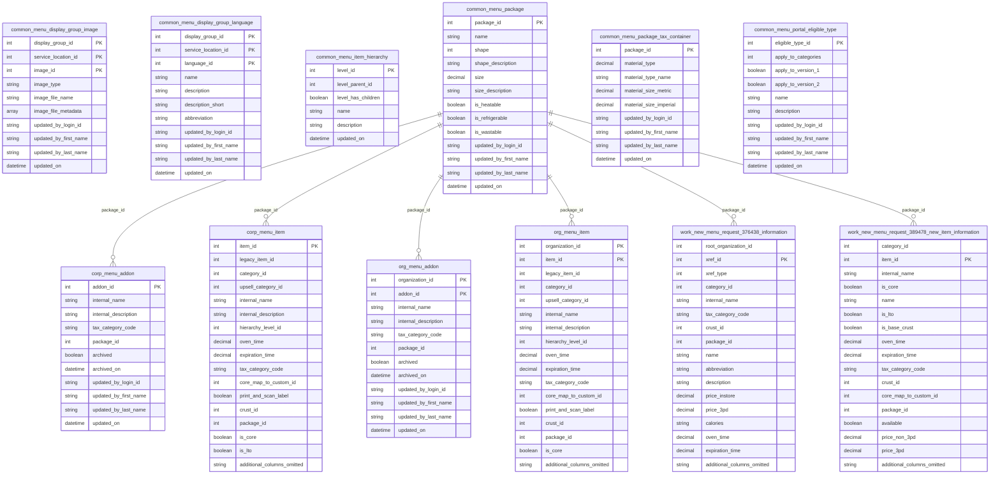

# master-menu - common-reference 3

```mermaid
erDiagram
    common_menu_display_group_image {
        int display_group_id PK
        int service_location_id PK
        int image_id PK
        string image_type
        string image_file_name
        array image_file_metadata
        string updated_by_login_id
        string updated_by_first_name
        string updated_by_last_name
        datetime updated_on
    }
    common_menu_display_group_language {
        int display_group_id PK
        int service_location_id PK
        int language_id PK
        string name
        string description
        string description_short
        string abbreviation
        string updated_by_login_id
        string updated_by_first_name
        string updated_by_last_name
        datetime updated_on
    }
    common_menu_item_hierarchy {
        int level_id PK
        int level_parent_id
        boolean level_has_children
        string name
        string description
        datetime updated_on
    }
    common_menu_package {
        int package_id PK
        string name
        int shape
        string shape_description
        decimal size
        string size_description
        boolean is_heatable
        boolean is_refrigerable
        boolean is_wastable
        string updated_by_login_id
        string updated_by_first_name
        string updated_by_last_name
        datetime updated_on
    }
    common_menu_package_tax_container {
        int package_id PK
        decimal material_type
        string material_type_name
        decimal material_size_metric
        decimal material_size_imperial
        string updated_by_login_id
        string updated_by_first_name
        string updated_by_last_name
        datetime updated_on
    }
    common_menu_portal_eligible_type {
        int eligible_type_id PK
        int apply_to_categories
        boolean apply_to_version_1
        boolean apply_to_version_2
        string name
        string description
        string updated_by_login_id
        string updated_by_first_name
        string updated_by_last_name
        datetime updated_on
    }
    corp_menu_addon {
        int addon_id PK
        string internal_name
        string internal_description
        string tax_category_code
        int package_id
        boolean archived
        datetime archived_on
        string updated_by_login_id
        string updated_by_first_name
        string updated_by_last_name
        datetime updated_on
    }
    corp_menu_item {
        int item_id PK
        int legacy_item_id
        int category_id
        int upsell_category_id
        string internal_name
        string internal_description
        int hierarchy_level_id
        decimal oven_time
        decimal expiration_time
        string tax_category_code
        int core_map_to_custom_id
        boolean print_and_scan_label
        int crust_id
        int package_id
        boolean is_core
        boolean is_lto
        string additional_columns_omitted
    }
    org_menu_addon {
        int organization_id PK
        int addon_id PK
        string internal_name
        string internal_description
        string tax_category_code
        int package_id
        boolean archived
        datetime archived_on
        string updated_by_login_id
        string updated_by_first_name
        string updated_by_last_name
        datetime updated_on
    }
    org_menu_item {
        int organization_id PK
        int item_id PK
        int legacy_item_id
        int category_id
        int upsell_category_id
        string internal_name
        string internal_description
        int hierarchy_level_id
        decimal oven_time
        decimal expiration_time
        string tax_category_code
        int core_map_to_custom_id
        boolean print_and_scan_label
        int crust_id
        int package_id
        boolean is_core
        string additional_columns_omitted
    }
    work_new_menu_request_376438_information {
        int root_organization_id
        int xref_id PK
        int xref_type
        int category_id
        string internal_name
        string tax_category_code
        int crust_id
        int package_id
        string name
        string abbreviation
        string description
        decimal price_instore
        decimal price_3pd
        string calories
        decimal oven_time
        decimal expiration_time
        string additional_columns_omitted
    }
    work_new_menu_request_389478_new_item_information {
        int category_id
        int item_id PK
        string internal_name
        boolean is_core
        string name
        boolean is_lto
        boolean is_base_crust
        decimal oven_time
        decimal expiration_time
        string tax_category_code
        int crust_id
        int core_map_to_custom_id
        int package_id
        boolean available
        decimal price_non_3pd
        decimal price_3pd
        string additional_columns_omitted
    }
    common_menu_package ||--o{ corp_menu_addon : package_id
    common_menu_package ||--o{ corp_menu_item : package_id
    common_menu_package ||--o{ org_menu_addon : package_id
    common_menu_package ||--o{ org_menu_item : package_id
    common_menu_package ||--o{ work_new_menu_request_376438_information : package_id
    common_menu_package ||--o{ work_new_menu_request_389478_new_item_information : package_id
```
