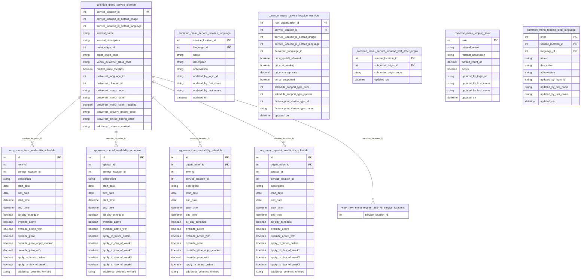

# master-menu - common-reference 4

```mermaid
erDiagram
    common_menu_service_location {
        int service_location_id PK
        int service_location_id_default_image
        int service_location_id_default_language
        string internal_name
        string internal_description
        int order_origin_id
        string order_origin_code
        string vertex_customer_class_code
        boolean market_place_location
        int deliverect_language_id
        int deliverect_channel_id
        string deliverect_menu_code
        string deliverect_menu_name
        boolean deliverect_menu_flatten_required
        string deliverect_delivery_pricing_code
        string deliverect_pickup_pricing_code
        string additional_columns_omitted
    }
    common_menu_service_location_language {
        int service_location_id PK
        int language_id PK
        string name
        string description
        string abbreviation
        string updated_by_login_id
        string updated_by_first_name
        string updated_by_last_name
        datetime updated_on
    }
    common_menu_service_location_override {
        int root_organization_id PK
        int service_location_id PK
        int service_location_id_default_image
        int service_location_id_default_language
        int deliverect_language_id
        boolean price_update_allowed
        boolean price_is_markup
        decimal price_markup_rate
        boolean portal_supported
        int schedule_support_type_item
        int schedule_support_type_special
        int factura_print_device_type_id
        string factura_print_device_type_name
        datetime updated_on
    }
    common_menu_service_location_xref_order_origin {
        int service_location_id PK
        int sub_order_origin_id PK
        string sub_order_origin_code
        datetime updated_on
    }
    common_menu_topping_level {
        int level PK
        string internal_name
        string internal_description
        decimal default_count_as
        boolean active
        string updated_by_login_id
        string updated_by_first_name
        string updated_by_last_name
        datetime updated_on
    }
    common_menu_topping_level_language {
        int level PK
        int service_location_id PK
        int language_id PK
        string name
        string description
        string abbreviation
        string updated_by_login_id
        string updated_by_first_name
        string updated_by_last_name
        datetime updated_on
    }
    corp_menu_item_availability_schedule {
        int id PK
        int item_id
        int service_location_id
        string description
        date start_date
        date end_date
        datetime start_time
        datetime end_time
        boolean all_day_schedule
        boolean override_active
        boolean override_active_with
        boolean override_price
        boolean override_price_apply_markup
        decimal override_price_with
        boolean apply_to_future_orders
        boolean apply_to_day_of_week1
        string additional_columns_omitted
    }
    corp_menu_special_availability_schedule {
        int id PK
        int special_id
        int service_location_id
        string description
        date start_date
        date end_date
        datetime start_time
        datetime end_time
        boolean all_day_schedule
        boolean override_active
        boolean override_active_with
        boolean apply_to_future_orders
        boolean apply_to_day_of_week1
        boolean apply_to_day_of_week2
        boolean apply_to_day_of_week3
        boolean apply_to_day_of_week4
        string additional_columns_omitted
    }
    org_menu_item_availability_schedule {
        int id PK
        int organization_id PK
        int item_id
        int service_location_id
        string description
        date start_date
        date end_date
        datetime start_time
        datetime end_time
        boolean all_day_schedule
        boolean override_active
        boolean override_active_with
        boolean override_price
        boolean override_price_apply_markup
        decimal override_price_with
        boolean apply_to_future_orders
        string additional_columns_omitted
    }
    org_menu_special_availability_schedule {
        int id PK
        int organization_id PK
        int special_id
        int service_location_id
        string description
        date start_date
        date end_date
        datetime start_time
        datetime end_time
        boolean all_day_schedule
        boolean override_active
        boolean override_active_with
        boolean apply_to_future_orders
        boolean apply_to_day_of_week1
        boolean apply_to_day_of_week2
        boolean apply_to_day_of_week3
        string additional_columns_omitted
    }
    work_new_menu_request_389478_service_locations {
        int service_location_id
    }
    common_menu_service_location ||--o{ corp_menu_item_availability_schedule : service_location_id
    common_menu_service_location ||--o{ corp_menu_special_availability_schedule : service_location_id
    common_menu_service_location ||--o{ org_menu_item_availability_schedule : service_location_id
    common_menu_service_location ||--o{ org_menu_special_availability_schedule : service_location_id
    common_menu_service_location ||--o{ work_new_menu_request_389478_service_locations : service_location_id
```
