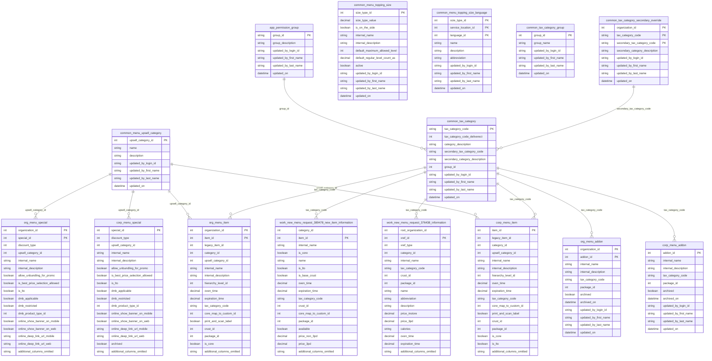

# master-menu - common-reference 5

```mermaid
erDiagram
    app_permission_group {
        string group_id PK
        string group_description
        string updated_by_login_id
        string updated_by_first_name
        string updated_by_last_name
        datetime updated_on
    }
    common_menu_topping_size {
        int size_type_id PK
        decimal size_type_value
        boolean is_on_the_side
        string internal_name
        string internal_description
        int default_maximum_allowed_level
        decimal default_regular_level_count_as
        boolean active
        string updated_by_login_id
        string updated_by_first_name
        string updated_by_last_name
        datetime updated_on
    }
    common_menu_topping_size_language {
        int size_type_id PK
        int service_location_id PK
        int language_id PK
        string name
        string description
        string abbreviation
        string updated_by_login_id
        string updated_by_first_name
        string updated_by_last_name
        datetime updated_on
    }
    common_menu_upsell_category {
        int upsell_category_id PK
        string name
        string description
        string updated_by_login_id
        string updated_by_first_name
        string updated_by_last_name
        datetime updated_on
    }
    common_tax_category {
        string tax_category_code PK
        int tax_category_code_deliverect
        string category_description
        string secondary_tax_category_code
        string secondary_category_description
        int group_id
        string updated_by_login_id
        string updated_by_first_name
        string updated_by_last_name
        datetime updated_on
    }
    common_tax_category_group {
        int group_id PK
        string group_name
        string updated_by_login_id
        string updated_by_first_name
        string updated_by_last_name
        datetime updated_on
    }
    common_tax_category_secondary_override {
        int organization_id PK
        string tax_category_code PK
        string secondary_tax_category_code PK
        string secondary_category_description
        string updated_by_login_id
        string updated_by_first_name
        string updated_by_last_name
        datetime updated_on
    }
    corp_menu_addon {
        int addon_id PK
        string internal_name
        string internal_description
        string tax_category_code
        int package_id
        boolean archived
        datetime archived_on
        string updated_by_login_id
        string updated_by_first_name
        string updated_by_last_name
        datetime updated_on
    }
    corp_menu_item {
        int item_id PK
        int legacy_item_id
        int category_id
        int upsell_category_id
        string internal_name
        string internal_description
        int hierarchy_level_id
        decimal oven_time
        decimal expiration_time
        string tax_category_code
        int core_map_to_custom_id
        boolean print_and_scan_label
        int crust_id
        int package_id
        boolean is_core
        boolean is_lto
        string additional_columns_omitted
    }
    corp_menu_special {
        int special_id PK
        int discount_type
        int upsell_category_id
        string internal_name
        string internal_description
        boolean allow_unbundling_for_promo
        boolean is_best_price_selection_allowed
        boolean is_lto
        boolean dmb_applicable
        boolean dmb_restricted
        int dmb_product_type_id
        boolean online_show_banner_on_mobile
        boolean online_show_banner_on_web
        string online_deep_link_url_mobile
        string online_deep_link_url_web
        boolean archived
        string additional_columns_omitted
    }
    org_menu_addon {
        int organization_id PK
        int addon_id PK
        string internal_name
        string internal_description
        string tax_category_code
        int package_id
        boolean archived
        datetime archived_on
        string updated_by_login_id
        string updated_by_first_name
        string updated_by_last_name
        datetime updated_on
    }
    org_menu_item {
        int organization_id PK
        int item_id PK
        int legacy_item_id
        int category_id
        int upsell_category_id
        string internal_name
        string internal_description
        int hierarchy_level_id
        decimal oven_time
        decimal expiration_time
        string tax_category_code
        int core_map_to_custom_id
        boolean print_and_scan_label
        int crust_id
        int package_id
        boolean is_core
        string additional_columns_omitted
    }
    org_menu_special {
        int organization_id PK
        int special_id PK
        int discount_type
        int upsell_category_id
        string internal_name
        string internal_description
        boolean allow_unbundling_for_promo
        boolean is_best_price_selection_allowed
        boolean is_lto
        boolean dmb_applicable
        boolean dmb_restricted
        int dmb_product_type_id
        boolean online_show_banner_on_mobile
        boolean online_show_banner_on_web
        string online_deep_link_url_mobile
        string online_deep_link_url_web
        string additional_columns_omitted
    }
    work_new_menu_request_376438_information {
        int root_organization_id
        int xref_id PK
        int xref_type
        int category_id
        string internal_name
        string tax_category_code
        int crust_id
        int package_id
        string name
        string abbreviation
        string description
        decimal price_instore
        decimal price_3pd
        string calories
        decimal oven_time
        decimal expiration_time
        string additional_columns_omitted
    }
    work_new_menu_request_389478_new_item_information {
        int category_id
        int item_id PK
        string internal_name
        boolean is_core
        string name
        boolean is_lto
        boolean is_base_crust
        decimal oven_time
        decimal expiration_time
        string tax_category_code
        int crust_id
        int core_map_to_custom_id
        int package_id
        boolean available
        decimal price_non_3pd
        decimal price_3pd
        string additional_columns_omitted
    }
    app_permission_group ||--o{ common_tax_category : group_id
    common_menu_upsell_category ||--o{ corp_menu_item : upsell_category_id
    common_menu_upsell_category ||--o{ corp_menu_special : upsell_category_id
    common_menu_upsell_category ||--o{ org_menu_item : upsell_category_id
    common_menu_upsell_category ||--o{ org_menu_special : upsell_category_id
    common_tax_category ||--o{ corp_menu_addon : tax_category_code
    common_tax_category ||--o{ corp_menu_item : tax_category_code
    common_tax_category ||--o{ org_menu_addon : tax_category_code
    common_tax_category ||--o{ org_menu_item : tax_category_code
    common_tax_category ||--o{ work_new_menu_request_376438_information : tax_category_code
    common_tax_category ||--o{ work_new_menu_request_389478_new_item_information : tax_category_code
    common_tax_category_secondary_override ||--o{ common_tax_category : secondary_tax_category_code
```
