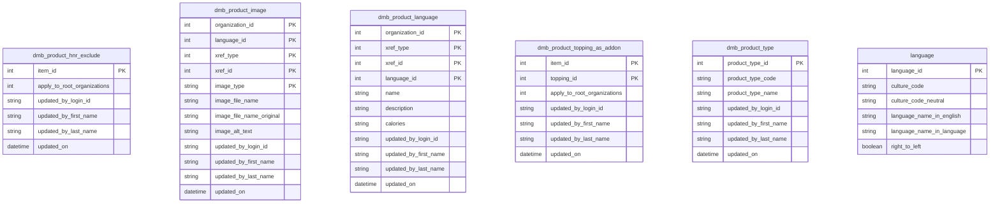

# master-menu - common-reference 6

```mermaid
erDiagram
    dmb_product_hnr_exclude {
        int item_id PK
        int apply_to_root_organizations
        string updated_by_login_id
        string updated_by_first_name
        string updated_by_last_name
        datetime updated_on
    }
    dmb_product_image {
        int organization_id PK
        int language_id PK
        int xref_type PK
        int xref_id PK
        string image_type PK
        string image_file_name
        string image_file_name_original
        string image_alt_text
        string updated_by_login_id
        string updated_by_first_name
        string updated_by_last_name
        datetime updated_on
    }
    dmb_product_language {
        int organization_id PK
        int xref_type PK
        int xref_id PK
        int language_id PK
        string name
        string description
        string calories
        string updated_by_login_id
        string updated_by_first_name
        string updated_by_last_name
        datetime updated_on
    }
    dmb_product_topping_as_addon {
        int item_id PK
        int topping_id PK
        int apply_to_root_organizations
        string updated_by_login_id
        string updated_by_first_name
        string updated_by_last_name
        datetime updated_on
    }
    dmb_product_type {
        int product_type_id PK
        string product_type_code
        string product_type_name
        string updated_by_login_id
        string updated_by_first_name
        string updated_by_last_name
        datetime updated_on
    }
    language {
        int language_id PK
        string culture_code
        string culture_code_neutral
        string language_name_in_english
        string language_name_in_language
        boolean right_to_left
    }
```
