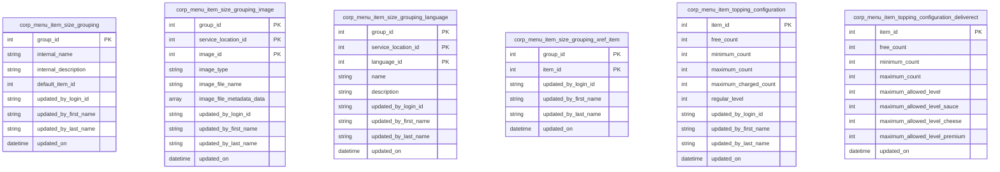

# master-menu - corporate-menu 4

```mermaid
erDiagram
    corp_menu_item_size_grouping {
        int group_id PK
        string internal_name
        string internal_description
        int default_item_id
        string updated_by_login_id
        string updated_by_first_name
        string updated_by_last_name
        datetime updated_on
    }
    corp_menu_item_size_grouping_image {
        int group_id PK
        int service_location_id PK
        int image_id PK
        string image_type
        string image_file_name
        array image_file_metadata_data
        string updated_by_login_id
        string updated_by_first_name
        string updated_by_last_name
        datetime updated_on
    }
    corp_menu_item_size_grouping_language {
        int group_id PK
        int service_location_id PK
        int language_id PK
        string name
        string description
        string updated_by_login_id
        string updated_by_first_name
        string updated_by_last_name
        datetime updated_on
    }
    corp_menu_item_size_grouping_xref_item {
        int group_id PK
        int item_id PK
        string updated_by_login_id
        string updated_by_first_name
        string updated_by_last_name
        datetime updated_on
    }
    corp_menu_item_topping_configuration {
        int item_id PK
        int free_count
        int minimum_count
        int maximum_count
        int maximum_charged_count
        int regular_level
        string updated_by_login_id
        string updated_by_first_name
        string updated_by_last_name
        datetime updated_on
    }
    corp_menu_item_topping_configuration_deliverect {
        int item_id PK
        int free_count
        int minimum_count
        int maximum_count
        int maximum_allowed_level
        int maximum_allowed_level_sauce
        int maximum_allowed_level_cheese
        int maximum_allowed_level_premium
        datetime updated_on
    }
```
