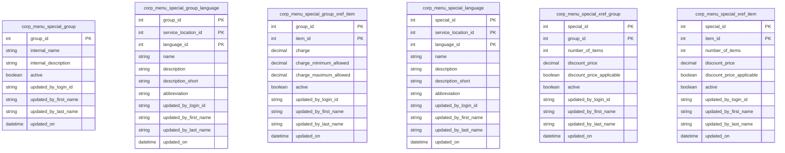

# master-menu - corporate-menu 6

```mermaid
erDiagram
    corp_menu_special_group {
        int group_id PK
        string internal_name
        string internal_description
        boolean active
        string updated_by_login_id
        string updated_by_first_name
        string updated_by_last_name
        datetime updated_on
    }
    corp_menu_special_group_language {
        int group_id PK
        int service_location_id PK
        int language_id PK
        string name
        string description
        string description_short
        string abbreviation
        string updated_by_login_id
        string updated_by_first_name
        string updated_by_last_name
        datetime updated_on
    }
    corp_menu_special_group_xref_item {
        int group_id PK
        int item_id PK
        decimal charge
        decimal charge_minimum_allowed
        decimal charge_maximum_allowed
        boolean active
        string updated_by_login_id
        string updated_by_first_name
        string updated_by_last_name
        datetime updated_on
    }
    corp_menu_special_language {
        int special_id PK
        int service_location_id PK
        int language_id PK
        string name
        string description
        string description_short
        string abbreviation
        string updated_by_login_id
        string updated_by_first_name
        string updated_by_last_name
        datetime updated_on
    }
    corp_menu_special_xref_group {
        int special_id PK
        int group_id PK
        int number_of_items
        decimal discount_price
        boolean discount_price_applicable
        boolean active
        string updated_by_login_id
        string updated_by_first_name
        string updated_by_last_name
        datetime updated_on
    }
    corp_menu_special_xref_item {
        int special_id PK
        int item_id PK
        int number_of_items
        decimal discount_price
        boolean discount_price_applicable
        boolean active
        string updated_by_login_id
        string updated_by_first_name
        string updated_by_last_name
        datetime updated_on
    }
```
