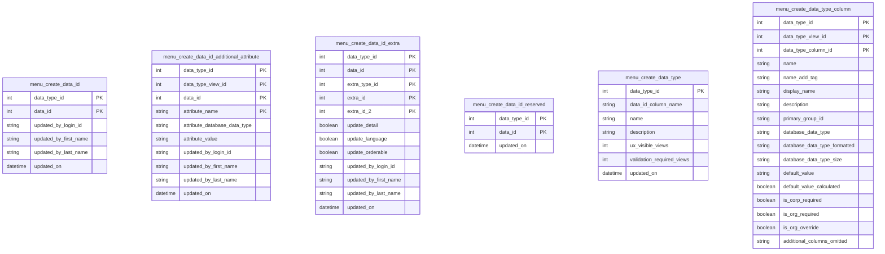

# master-menu - menu-creation 1

```mermaid
erDiagram
    menu_create_data_id {
        int data_type_id PK
        int data_id PK
        string updated_by_login_id
        string updated_by_first_name
        string updated_by_last_name
        datetime updated_on
    }
    menu_create_data_id_additional_attribute {
        int data_type_id PK
        int data_type_view_id PK
        int data_id PK
        string attribute_name PK
        string attribute_database_data_type
        string attribute_value
        string updated_by_login_id
        string updated_by_first_name
        string updated_by_last_name
        datetime updated_on
    }
    menu_create_data_id_extra {
        int data_type_id PK
        int data_id PK
        int extra_type_id PK
        int extra_id PK
        int extra_id_2 PK
        boolean update_detail
        boolean update_language
        boolean update_orderable
        string updated_by_login_id
        string updated_by_first_name
        string updated_by_last_name
        datetime updated_on
    }
    menu_create_data_id_reserved {
        int data_type_id PK
        int data_id PK
        datetime updated_on
    }
    menu_create_data_type {
        int data_type_id PK
        string data_id_column_name
        string name
        string description
        int ux_visible_views
        int validation_required_views
        datetime updated_on
    }
    menu_create_data_type_column {
        int data_type_id PK
        int data_type_view_id PK
        int data_type_column_id PK
        string name
        string name_add_tag
        string display_name
        string description
        string primary_group_id
        string database_data_type
        string database_data_type_formatted
        string database_data_type_size
        string default_value
        boolean default_value_calculated
        boolean is_corp_required
        boolean is_org_required
        boolean is_org_override
        string additional_columns_omitted
    }
```
