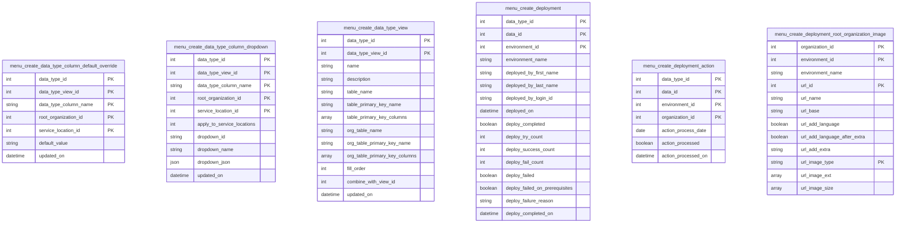

# master-menu - menu-creation 2

```mermaid
erDiagram
    menu_create_data_type_column_default_override {
        int data_type_id PK
        int data_type_view_id PK
        string data_type_column_name PK
        int root_organization_id PK
        int service_location_id PK
        string default_value
        datetime updated_on
    }
    menu_create_data_type_column_dropdown {
        int data_type_id PK
        int data_type_view_id PK
        string data_type_column_name PK
        int root_organization_id PK
        int service_location_id PK
        int apply_to_service_locations
        string dropdown_id
        string dropdown_name
        json dropdown_json
        datetime updated_on
    }
    menu_create_data_type_view {
        int data_type_id PK
        int data_type_view_id PK
        string name
        string description
        string table_name
        string table_primary_key_name
        array table_primary_key_columns
        string org_table_name
        string org_table_primary_key_name
        array org_table_primary_key_columns
        int fill_order
        int combine_with_view_id
        datetime updated_on
    }
    menu_create_deployment {
        int data_type_id PK
        int data_id PK
        int environment_id PK
        string environment_name
        string deployed_by_first_name
        string deployed_by_last_name
        string deployed_by_login_id
        datetime deployed_on
        boolean deploy_completed
        int deploy_try_count
        int deploy_success_count
        int deploy_fail_count
        boolean deploy_failed
        boolean deploy_failed_on_prerequisites
        string deploy_failure_reason
        datetime deploy_completed_on
    }
    menu_create_deployment_action {
        int data_type_id PK
        int data_id PK
        int environment_id PK
        int organization_id PK
        date action_process_date
        boolean action_processed
        datetime action_processed_on
    }
    menu_create_deployment_root_organization_image {
        int organization_id PK
        int environment_id PK
        string environment_name
        int url_id PK
        string url_name
        string url_base
        boolean url_add_language
        boolean url_add_language_after_extra
        string url_add_extra
        string url_image_type PK
        array url_image_ext
        array url_image_size
    }
```
