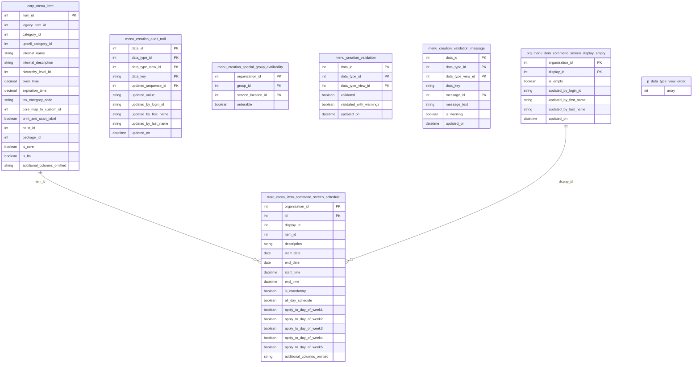

# master-menu - miscellaneous

```mermaid
erDiagram
    corp_menu_item {
        int item_id PK
        int legacy_item_id
        int category_id
        int upsell_category_id
        string internal_name
        string internal_description
        int hierarchy_level_id
        decimal oven_time
        decimal expiration_time
        string tax_category_code
        int core_map_to_custom_id
        boolean print_and_scan_label
        int crust_id
        int package_id
        boolean is_core
        boolean is_lto
        string additional_columns_omitted
    }
    menu_creation_audit_trail {
        int data_id PK
        int data_type_id PK
        int data_type_view_id PK
        string data_key PK
        int updated_sequence_id PK
        string updated_value
        string updated_by_login_id
        string updated_by_first_name
        string updated_by_last_name
        datetime updated_on
    }
    menu_creation_special_group_availability {
        int organization_id PK
        int group_id PK
        int service_location_id PK
        boolean orderable
    }
    menu_creation_validation {
        int data_id PK
        int data_type_id PK
        int data_type_view_id PK
        boolean validated
        boolean validated_with_warnings
        datetime updated_on
    }
    menu_creation_validation_message {
        int data_id PK
        int data_type_id PK
        int data_type_view_id PK
        string data_key
        int message_id PK
        string mesaage_text
        boolean is_warning
        datetime updated_on
    }
    org_menu_item_command_screen_display_empty {
        int organization_id PK
        int display_id PK
        boolean is_empty
        string updated_by_login_id
        string updated_by_first_name
        string updated_by_last_name
        datetime updated_on
    }
    p_data_type_view_order {
        int array
    }
    store_menu_item_command_screen_schedule {
        int organization_id PK
        int id PK
        int display_id
        int item_id
        string description
        date start_date
        date end_date
        datetime start_time
        datetime end_time
        boolean is_mandatory
        boolean all_day_schedule
        boolean apply_to_day_of_week1
        boolean apply_to_day_of_week2
        boolean apply_to_day_of_week3
        boolean apply_to_day_of_week4
        boolean apply_to_day_of_week5
        string additional_columns_omitted
    }
    corp_menu_item ||--o{ store_menu_item_command_screen_schedule : item_id
    org_menu_item_command_screen_display_empty ||--o{ store_menu_item_command_screen_schedule : display_id
```
