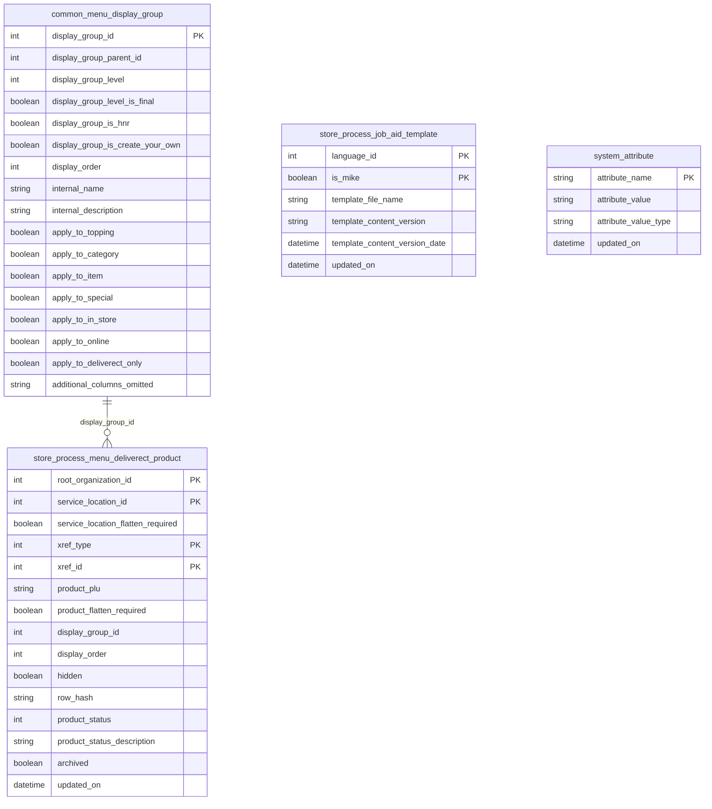

# master-menu - operations-audit-process

```mermaid
erDiagram
    common_menu_display_group {
        int display_group_id PK
        int display_group_parent_id
        int display_group_level
        boolean display_group_level_is_final
        boolean display_group_is_hnr
        boolean display_group_is_create_your_own
        int display_order
        string internal_name
        string internal_description
        boolean apply_to_topping
        boolean apply_to_category
        boolean apply_to_item
        boolean apply_to_special
        boolean apply_to_in_store
        boolean apply_to_online
        boolean apply_to_deliverect_only
        string additional_columns_omitted
    }
    store_process_job_aid_template {
        int language_id PK
        boolean is_mike PK
        string template_file_name
        string template_content_version
        datetime template_content_version_date
        datetime updated_on
    }
    store_process_menu_deliverect_product {
        int root_organization_id PK
        int service_location_id PK
        boolean service_location_flatten_required
        int xref_type PK
        int xref_id PK
        string product_plu
        boolean product_flatten_required
        int display_group_id
        int display_order
        boolean hidden
        string row_hash
        int product_status
        string product_status_description
        boolean archived
        datetime updated_on
    }
    system_attribute {
        string attribute_name PK
        string attribute_value
        string attribute_value_type
        datetime updated_on
    }
    common_menu_display_group ||--o{ store_process_menu_deliverect_product : display_group_id
```
