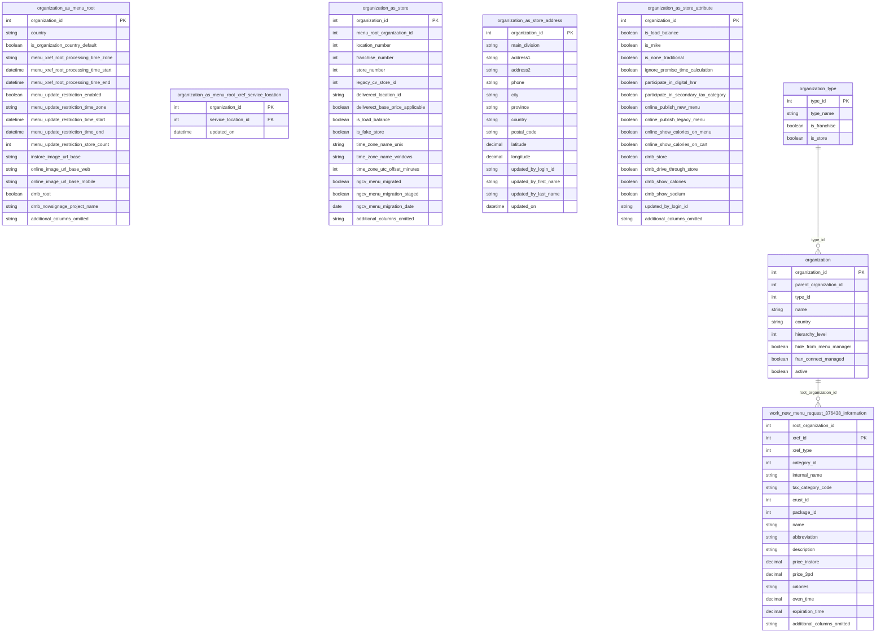

# master-menu - organization 1

```mermaid
erDiagram
    organization {
        int organization_id PK
        int parent_organization_id
        int type_id
        string name
        string country
        int hierarchy_level
        boolean hide_from_menu_manager
        boolean fran_connect_managed
        boolean active
    }
    organization_as_menu_root {
        int organization_id PK
        string country
        boolean is_organization_country_default
        string menu_xref_root_processing_time_zone
        datetime menu_xref_root_processing_time_start
        datetime menu_xref_root_processing_time_end
        boolean menu_update_restriction_enabled
        string menu_update_restriction_time_zone
        datetime menu_update_restriction_time_start
        datetime menu_update_restriction_time_end
        int menu_update_restriction_store_count
        string instore_image_url_base
        string online_image_url_base_web
        string online_image_url_base_mobile
        boolean dmb_root
        string dmb_nowsignage_project_name
        string additional_columns_omitted
    }
    organization_as_menu_root_xref_service_location {
        int organization_id PK
        int service_location_id PK
        datetime updated_on
    }
    organization_as_store {
        int organization_id PK
        int menu_root_organization_id
        int location_number
        int franchise_number
        int store_number
        int legacy_cv_store_id
        string deliverect_location_id
        boolean deliverect_base_price_applicable
        boolean is_load_balance
        boolean is_fake_store
        string time_zone_name_unix
        string time_zone_name_windows
        int time_zone_utc_offset_minutes
        boolean ngcv_menu_migrated
        boolean ngcv_menu_migration_staged
        date ngcv_menu_migration_date
        string additional_columns_omitted
    }
    organization_as_store_address {
        int organization_id PK
        string main_division
        string address1
        string address2
        string phone
        string city
        string province
        string country
        string postal_code
        decimal latitude
        decimal longitude
        string updated_by_login_id
        string updated_by_first_name
        string updated_by_last_name
        datetime updated_on
    }
    organization_as_store_attribute {
        int organization_id PK
        boolean is_load_balance
        boolean is_mike
        boolean is_none_traditional
        boolean ignore_promise_time_calculation
        boolean participate_in_digital_hnr
        boolean participate_in_secondary_tax_category
        boolean online_publish_new_menu
        boolean online_publish_legacy_menu
        boolean online_show_calories_on_menu
        boolean online_show_calories_on_cart
        boolean dmb_store
        boolean dmb_drive_through_store
        boolean dmb_show_calories
        boolean dmb_show_sodium
        string updated_by_login_id
        string additional_columns_omitted
    }
    organization_type {
        int type_id PK
        string type_name
        boolean is_franchise
        boolean is_store
    }
    work_new_menu_request_376438_information {
        int root_organization_id
        int xref_id PK
        int xref_type
        int category_id
        string internal_name
        string tax_category_code
        int crust_id
        int package_id
        string name
        string abbreviation
        string description
        decimal price_instore
        decimal price_3pd
        string calories
        decimal oven_time
        decimal expiration_time
        string additional_columns_omitted
    }
    organization ||--o{ work_new_menu_request_376438_information : root_organization_id
    organization_type ||--o{ organization : type_id
```
