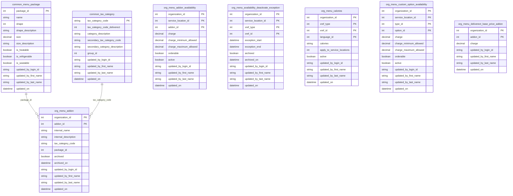

# master-menu - organization-menu-overrides 1

```mermaid
erDiagram
    common_menu_package {
        int package_id PK
        string name
        int shape
        string shape_description
        decimal size
        string size_description
        boolean is_heatable
        boolean is_refrigerable
        boolean is_wastable
        string updated_by_login_id
        string updated_by_first_name
        string updated_by_last_name
        datetime updated_on
    }
    common_tax_category {
        string tax_category_code PK
        int tax_category_code_deliverect
        string category_description
        string secondary_tax_category_code
        string secondary_category_description
        int group_id
        string updated_by_login_id
        string updated_by_first_name
        string updated_by_last_name
        datetime updated_on
    }
    org_menu_addon {
        int organization_id PK
        int addon_id PK
        string internal_name
        string internal_description
        string tax_category_code
        int package_id
        boolean archived
        datetime archived_on
        string updated_by_login_id
        string updated_by_first_name
        string updated_by_last_name
        datetime updated_on
    }
    org_menu_addon_availability {
        int organization_id PK
        int service_location_id PK
        int addon_id PK
        decimal charge
        decimal charge_minimum_allowed
        decimal charge_maximum_allowed
        boolean orderable
        boolean active
        string updated_by_login_id
        string updated_by_first_name
        string updated_by_last_name
        datetime updated_on
    }
    org_menu_availability_deactivate_exception {
        int organization_id PK
        int service_location_id PK
        int xref_type PK
        int xref_id PK
        datetime exception_start
        datetime exception_end
        boolean archived
        datetime archived_on
        string updated_by_login_id
        string updated_by_first_name
        string updated_by_last_name
        datetime updated_on
    }
    org_menu_calories {
        int organization_id PK
        int xref_type PK
        int xref_id PK
        int language_id PK
        string calories
        int apply_to_service_locations
        boolean active
        string updated_by_login_id
        string updated_by_first_name
        string updated_by_last_name
        datetime updated_on
    }
    org_menu_custom_option_availability {
        int organization_id PK
        int service_location_id PK
        int type_id PK
        int option_id PK
        decimal charge
        decimal charge_minimum_allowed
        decimal charge_maximum_allowed
        boolean orderable
        boolean active
        string updated_by_login_id
        string updated_by_first_name
        string updated_by_last_name
        datetime updated_on
    }
    org_menu_deliverect_base_price_addon {
        int organization_id PK
        int addon_id PK
        decimal charge
        string updated_by_login_id
        string updated_by_first_name
        string updated_by_last_name
        datetime updated_on
    }
    common_menu_package ||--o{ org_menu_addon : package_id
    common_tax_category ||--o{ org_menu_addon : tax_category_code
```
