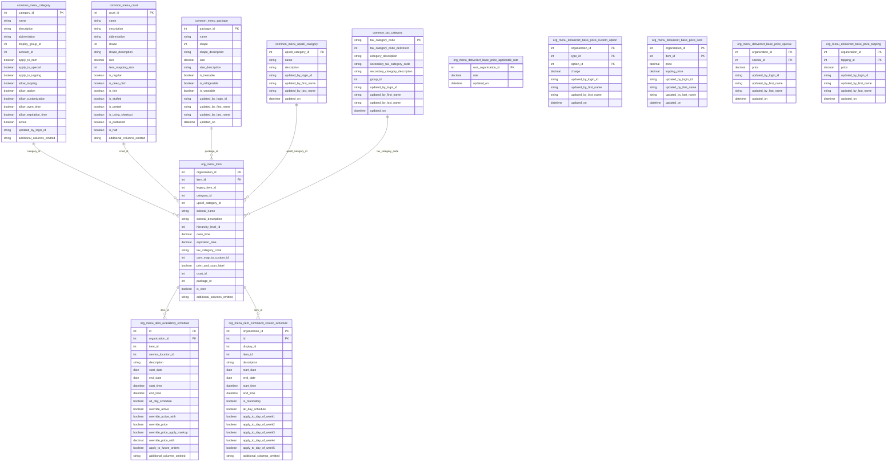

# master-menu - organization-menu-overrides 2

```mermaid
erDiagram
    common_menu_category {
        int category_id PK
        string name
        string description
        string abbreviation
        int display_group_id
        int account_id
        boolean apply_to_item
        boolean apply_to_special
        boolean apply_to_topping
        boolean allow_topping
        boolean allow_addon
        boolean allow_customization
        boolean allow_oven_time
        boolean allow_expiration_time
        boolean active
        string updated_by_login_id
        string additional_columns_omitted
    }
    common_menu_crust {
        int crust_id PK
        string name
        string description
        string abbreviation
        int shape
        string shape_description
        decimal size
        int item_mapping_size
        boolean is_regular
        boolean is_deep_dish
        boolean is_thin
        boolean is_stuffed
        boolean is_pretzel
        boolean is_using_sheetout
        boolean is_parbaked
        boolean is_half
        string additional_columns_omitted
    }
    common_menu_package {
        int package_id PK
        string name
        int shape
        string shape_description
        decimal size
        string size_description
        boolean is_heatable
        boolean is_refrigerable
        boolean is_wastable
        string updated_by_login_id
        string updated_by_first_name
        string updated_by_last_name
        datetime updated_on
    }
    common_menu_upsell_category {
        int upsell_category_id PK
        string name
        string description
        string updated_by_login_id
        string updated_by_first_name
        string updated_by_last_name
        datetime updated_on
    }
    common_tax_category {
        string tax_category_code PK
        int tax_category_code_deliverect
        string category_description
        string secondary_tax_category_code
        string secondary_category_description
        int group_id
        string updated_by_login_id
        string updated_by_first_name
        string updated_by_last_name
        datetime updated_on
    }
    org_menu_deliverect_base_price_applicable_rate {
        int root_organization_id PK
        decimal rate
        datetime updated_on
    }
    org_menu_deliverect_base_price_custom_option {
        int organization_id PK
        int type_id PK
        int option_id PK
        decimal charge
        string updated_by_login_id
        string updated_by_first_name
        string updated_by_last_name
        datetime updated_on
    }
    org_menu_deliverect_base_price_item {
        int organization_id PK
        int item_id PK
        decimal price
        decimal topping_price
        string updated_by_login_id
        string updated_by_first_name
        string updated_by_last_name
        datetime updated_on
    }
    org_menu_deliverect_base_price_special {
        int organization_id PK
        int special_id PK
        decimal price
        string updated_by_login_id
        string updated_by_first_name
        string updated_by_last_name
        datetime updated_on
    }
    org_menu_deliverect_base_price_topping {
        int organization_id PK
        int topping_id PK
        decimal price
        string updated_by_login_id
        string updated_by_first_name
        string updated_by_last_name
        datetime updated_on
    }
    org_menu_item {
        int organization_id PK
        int item_id PK
        int legacy_item_id
        int category_id
        int upsell_category_id
        string internal_name
        string internal_description
        int hierarchy_level_id
        decimal oven_time
        decimal expiration_time
        string tax_category_code
        int core_map_to_custom_id
        boolean print_and_scan_label
        int crust_id
        int package_id
        boolean is_core
        string additional_columns_omitted
    }
    org_menu_item_availability_schedule {
        int id PK
        int organization_id PK
        int item_id
        int service_location_id
        string description
        date start_date
        date end_date
        datetime start_time
        datetime end_time
        boolean all_day_schedule
        boolean override_active
        boolean override_active_with
        boolean override_price
        boolean override_price_apply_markup
        decimal override_price_with
        boolean apply_to_future_orders
        string additional_columns_omitted
    }
    org_menu_item_command_screen_schedule {
        int organization_id PK
        int id PK
        int display_id
        int item_id
        string description
        date start_date
        date end_date
        datetime start_time
        datetime end_time
        boolean is_mandatory
        boolean all_day_schedule
        boolean apply_to_day_of_week1
        boolean apply_to_day_of_week2
        boolean apply_to_day_of_week3
        boolean apply_to_day_of_week4
        boolean apply_to_day_of_week5
        string additional_columns_omitted
    }
    common_menu_category ||--o{ org_menu_item : category_id
    common_menu_crust ||--o{ org_menu_item : crust_id
    common_menu_package ||--o{ org_menu_item : package_id
    common_menu_upsell_category ||--o{ org_menu_item : upsell_category_id
    common_tax_category ||--o{ org_menu_item : tax_category_code
    org_menu_item ||--o{ org_menu_item_availability_schedule : item_id
    org_menu_item ||--o{ org_menu_item_command_screen_schedule : item_id
```
