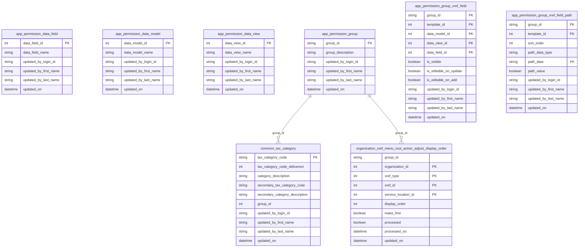

# master-menu - permissions 1

```mermaid
erDiagram
    app_permission_data_field {
        int data_field_id PK
        string data_field_name
        string updated_by_login_id
        string updated_by_first_name
        string updated_by_last_name
        datetime updated_on
    }
    app_permission_data_model {
        int data_model_id PK
        string data_model_name
        string updated_by_login_id
        string updated_by_first_name
        string updated_by_last_name
        datetime updated_on
    }
    app_permission_data_view {
        int data_view_id PK
        string data_view_name
        string updated_by_login_id
        string updated_by_first_name
        string updated_by_last_name
        datetime updated_on
    }
    app_permission_group {
        string group_id PK
        string group_description
        string updated_by_login_id
        string updated_by_first_name
        string updated_by_last_name
        datetime updated_on
    }
    app_permission_group_xref_field {
        string group_id PK
        int template_id PK
        int data_model_id PK
        int data_view_id PK
        int data_field_id PK
        boolean is_visible
        boolean is_editable_on_update
        boolean is_editable_on_add
        string updated_by_login_id
        string updated_by_first_name
        string updated_by_last_name
        datetime updated_on
    }
    app_permission_group_xref_field_path {
        string group_id PK
        int template_id PK
        int sort_order
        string path_data_type
        string path_data PK
        boolean path_value
        string updated_by_login_id
        string updated_by_first_name
        string updated_by_last_name
        datetime updated_on
    }
    common_tax_category {
        string tax_category_code PK
        int tax_category_code_deliverect
        string category_description
        string secondary_tax_category_code
        string secondary_category_description
        int group_id
        string updated_by_login_id
        string updated_by_first_name
        string updated_by_last_name
        datetime updated_on
    }
    organization_xref_menu_root_action_adjust_display_order {
        string group_id
        int organization_id PK
        int xref_type PK
        int xref_id PK
        int service_location_id PK
        int display_order
        boolean make_first
        boolean processed
        datetime processed_on
        datetime updated_on
    }
    app_permission_group ||--o{ common_tax_category : group_id
    app_permission_group ||--o{ organization_xref_menu_root_action_adjust_display_order : group_id
```
