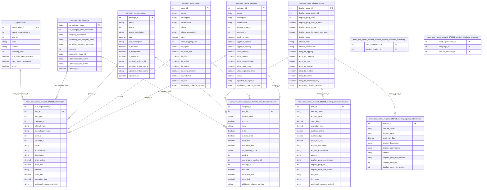

# master-menu - work-temp 1

```mermaid
erDiagram
    common_menu_category {
        int category_id PK
        string name
        string description
        string abbreviation
        int display_group_id
        int account_id
        boolean apply_to_item
        boolean apply_to_special
        boolean apply_to_topping
        boolean allow_topping
        boolean allow_addon
        boolean allow_customization
        boolean allow_oven_time
        boolean allow_expiration_time
        boolean active
        string updated_by_login_id
        string additional_columns_omitted
    }
    common_menu_crust {
        int crust_id PK
        string name
        string description
        string abbreviation
        int shape
        string shape_description
        decimal size
        int item_mapping_size
        boolean is_regular
        boolean is_deep_dish
        boolean is_thin
        boolean is_stuffed
        boolean is_pretzel
        boolean is_using_sheetout
        boolean is_parbaked
        boolean is_half
        string additional_columns_omitted
    }
    common_menu_display_group {
        int display_group_id PK
        int display_group_parent_id
        int display_group_level
        boolean display_group_level_is_final
        boolean display_group_is_hnr
        boolean display_group_is_create_your_own
        int display_order
        string internal_name
        string internal_description
        boolean apply_to_topping
        boolean apply_to_category
        boolean apply_to_item
        boolean apply_to_special
        boolean apply_to_in_store
        boolean apply_to_online
        boolean apply_to_deliverect_only
        string additional_columns_omitted
    }
    common_menu_package {
        int package_id PK
        string name
        int shape
        string shape_description
        decimal size
        string size_description
        boolean is_heatable
        boolean is_refrigerable
        boolean is_wastable
        string updated_by_login_id
        string updated_by_first_name
        string updated_by_last_name
        datetime updated_on
    }
    common_tax_category {
        string tax_category_code PK
        int tax_category_code_deliverect
        string category_description
        string secondary_tax_category_code
        string secondary_category_description
        int group_id
        string updated_by_login_id
        string updated_by_first_name
        string updated_by_last_name
        datetime updated_on
    }
    organization {
        int organization_id PK
        int parent_organization_id
        int type_id
        string name
        string country
        int hierarchy_level
        boolean hide_from_menu_manager
        boolean fran_connect_managed
        boolean active
    }
    work_new_menu_request_376438_information {
        int root_organization_id
        int xref_id PK
        int xref_type
        int category_id
        string internal_name
        string tax_category_code
        int crust_id
        int package_id
        string name
        string abbreviation
        string description
        decimal price_instore
        decimal price_3pd
        string calories
        decimal oven_time
        decimal expiration_time
        string additional_columns_omitted
    }
    work_new_menu_request_376438_service_locations_availability {
        int root_organization_id PK
        int service_location_id PK
    }
    work_new_menu_request_376438_service_locations_language {
        int root_organization_id PK
        int language_id PK
        int service_location_id PK
    }
    work_new_menu_request_389478_existing_item_information {
        int item_id PK
        string internal_name
        string english_name
        decimal oven_time
        decimal expiration_time
        boolean available_online
        boolean available_3pd
        decimal price_non_3pd
        string english_description
        string english_abbreviation
        string calories
        string display_group_non_instore
        int display_group_id
        int display_order_non_instore
        string hnr_days
        string hnr_hours
        string additional_columns_omitted
    }
    work_new_menu_request_389478_existing_special_information {
        int special_id PK
        string internal_name
        string english_name
        decimal price_non_3pd
        string english_description
        string english_abbreviation
        string calories
        string display_group_non_instore
        int display_group_id
        int display_order_non_instore
    }
    work_new_menu_request_389478_new_item_information {
        int category_id
        int item_id PK
        string internal_name
        boolean is_core
        string name
        boolean is_lto
        boolean is_base_crust
        decimal oven_time
        decimal expiration_time
        string tax_category_code
        int crust_id
        int core_map_to_custom_id
        int package_id
        boolean available
        decimal price_non_3pd
        decimal price_3pd
        string additional_columns_omitted
    }
    common_menu_category ||--o{ work_new_menu_request_376438_information : category_id
    common_menu_category ||--o{ work_new_menu_request_389478_new_item_information : category_id
    common_menu_crust ||--o{ work_new_menu_request_376438_information : crust_id
    common_menu_crust ||--o{ work_new_menu_request_389478_new_item_information : crust_id
    common_menu_display_group ||--o{ work_new_menu_request_389478_existing_item_information : display_group_id
    common_menu_display_group ||--o{ work_new_menu_request_389478_existing_special_information : display_group_id
    common_menu_display_group ||--o{ work_new_menu_request_389478_new_item_information : display_group_id
    common_menu_package ||--o{ work_new_menu_request_376438_information : package_id
    common_menu_package ||--o{ work_new_menu_request_389478_new_item_information : package_id
    common_tax_category ||--o{ work_new_menu_request_376438_information : tax_category_code
    common_tax_category ||--o{ work_new_menu_request_389478_new_item_information : tax_category_code
    organization ||--o{ work_new_menu_request_376438_information : root_organization_id
```
