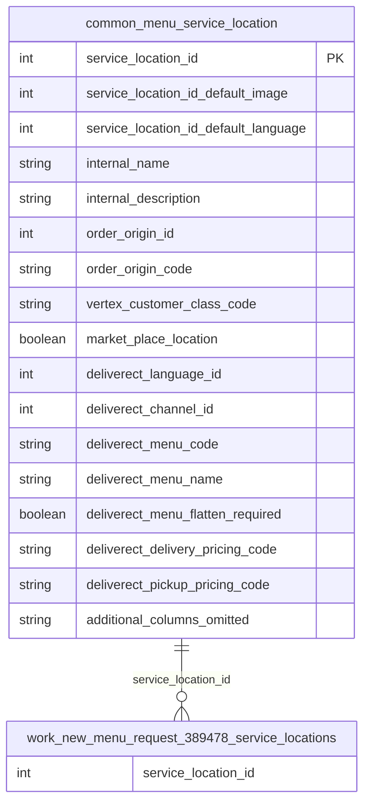

# master-menu - work-temp 2

```mermaid
erDiagram
    common_menu_service_location {
        int service_location_id PK
        int service_location_id_default_image
        int service_location_id_default_language
        string internal_name
        string internal_description
        int order_origin_id
        string order_origin_code
        string vertex_customer_class_code
        boolean market_place_location
        int deliverect_language_id
        int deliverect_channel_id
        string deliverect_menu_code
        string deliverect_menu_name
        boolean deliverect_menu_flatten_required
        string deliverect_delivery_pricing_code
        string deliverect_pickup_pricing_code
        string additional_columns_omitted
    }
    work_new_menu_request_389478_service_locations {
        int service_location_id
    }
    common_menu_service_location ||--o{ work_new_menu_request_389478_service_locations : service_location_id
```
