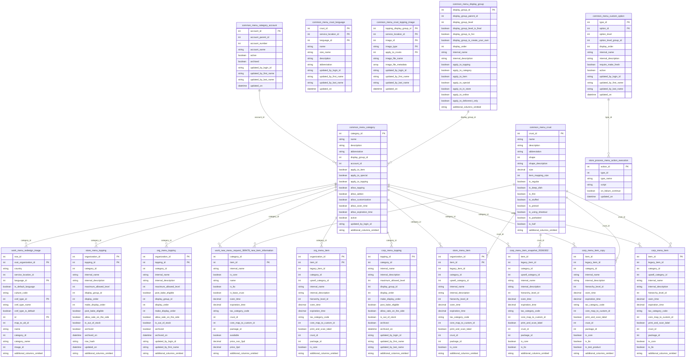

# menu-publisher - common-reference 1

```mermaid
erDiagram
    common_menu_category {
        int category_id PK
        string name
        string description
        string abbreviation
        int display_group_id
        int account_id
        boolean apply_to_item
        boolean apply_to_special
        boolean apply_to_topping
        boolean allow_topping
        boolean allow_addon
        boolean allow_customization
        boolean allow_oven_time
        boolean allow_expiration_time
        boolean active
        string updated_by_login_id
        string additional_columns_omitted
    }
    common_menu_category_account {
        int account_id PK
        int account_parent_id
        int account_number
        string account_name
        boolean active
        boolean archived
        string updated_by_login_id
        string updated_by_first_name
        string updated_by_last_name
        datetime updated_on
    }
    common_menu_crust {
        int crust_id PK
        string name
        string description
        string abbreviation
        int shape
        string shape_description
        decimal size
        int item_mapping_size
        boolean is_regular
        boolean is_deep_dish
        boolean is_thin
        boolean is_stuffed
        boolean is_pretzel
        boolean is_using_sheetout
        boolean is_parbaked
        boolean is_half
        string additional_columns_omitted
    }
    common_menu_crust_language {
        int crust_id PK
        int service_location_id PK
        int language_id PK
        string name
        string size_name
        string description
        string abbreviation
        string updated_by_login_id
        string updated_by_first_name
        string updated_by_last_name
        datetime updated_on
    }
    common_menu_crust_topping_image {
        int topping_display_group_id PK
        int service_location_id PK
        int image_id PK
        string image_type PK
        int apply_to_crusts PK
        string image_file_name
        array image_file_metadata
        string updated_by_login_id
        string updated_by_first_name
        string updated_by_last_name
        datetime updated_on
    }
    common_menu_custom_option {
        int type_id PK
        int option_id PK
        int option_level
        int option_level_group_id
        int display_order
        string internal_name
        string internal_description
        boolean require_make_fresh
        boolean active
        string updated_by_login_id
        string updated_by_first_name
        string updated_by_last_name
        datetime updated_on
    }
    common_menu_display_group {
        int display_group_id PK
        int display_group_parent_id
        int display_group_level
        boolean display_group_level_is_final
        boolean display_group_is_hnr
        boolean display_group_is_create_your_own
        int display_order
        string internal_name
        string internal_description
        boolean apply_to_topping
        boolean apply_to_category
        boolean apply_to_item
        boolean apply_to_special
        boolean apply_to_in_store
        boolean apply_to_online
        boolean apply_to_deliverect_only
        string additional_columns_omitted
    }
    corp_menu_item {
        int item_id PK
        int legacy_item_id
        int category_id
        int upsell_category_id
        string internal_name
        string internal_description
        int hierarchy_level_id
        decimal oven_time
        decimal expiration_time
        string tax_category_code
        int core_map_to_custom_id
        boolean print_and_scan_label
        int crust_id
        int package_id
        boolean is_core
        boolean is_lto
        string additional_columns_omitted
    }
    corp_menu_item_copy {
        int item_id
        int legacy_item_id
        int category_id
        string internal_name
        string internal_description
        int hierarchy_level_id
        decimal oven_time
        decimal expiration_time
        string tax_category_code
        int core_map_to_custom_id
        boolean print_and_scan_label
        int crust_id
        int package_id
        boolean is_core
        boolean is_lto
        boolean is_test_product
        string additional_columns_omitted
    }
    corp_menu_item_snapshot_20260302 {
        int item_id
        int legacy_item_id
        int category_id
        int upsell_category_id
        string internal_name
        string internal_description
        int hierarchy_level_id
        decimal oven_time
        decimal expiration_time
        string tax_category_code
        int core_map_to_custom_id
        boolean print_and_scan_label
        int crust_id
        int package_id
        boolean is_core
        boolean is_lto
        string additional_columns_omitted
    }
    corp_menu_topping {
        int topping_id PK
        int category_id
        string internal_name
        string internal_description
        int maximum_allowed_level
        int display_group_id
        int display_order
        int make_display_order
        boolean post_bake_eligible
        boolean allow_sale_on_the_side
        boolean is_out_of_stock
        boolean archived
        datetime archived_on
        string updated_by_login_id
        string updated_by_first_name
        string updated_by_last_name
        string additional_columns_omitted
    }
    org_menu_item {
        int organization_id PK
        int item_id PK
        int legacy_item_id
        int category_id
        int upsell_category_id
        string internal_name
        string internal_description
        int hierarchy_level_id
        decimal oven_time
        decimal expiration_time
        string tax_category_code
        int core_map_to_custom_id
        boolean print_and_scan_label
        int crust_id
        int package_id
        boolean is_core
        string additional_columns_omitted
    }
    org_menu_topping {
        int organization_id PK
        int topping_id PK
        int category_id
        string internal_name
        string internal_description
        int maximum_allowed_level
        boolean post_bake_eligible
        int display_group_id
        int display_order
        int make_display_order
        boolean allow_sale_on_the_side
        boolean is_out_of_stock
        boolean archived
        datetime archived_on
        string updated_by_login_id
        string updated_by_first_name
        string additional_columns_omitted
    }
    store_menu_item {
        int organization_id PK
        int item_id PK
        int legacy_item_id
        int category_id
        int upsell_category_id
        string internal_name
        string internal_description
        int hierarchy_level_id
        decimal oven_time
        decimal expiration_time
        string tax_category_code
        int core_map_to_custom_id
        boolean print_and_scan_label
        int crust_id
        int package_id
        boolean is_core
        string additional_columns_omitted
    }
    store_menu_topping {
        int organization_id PK
        int topping_id PK
        int category_id
        string internal_name
        string internal_description
        int maximum_allowed_level
        int display_group_id
        int display_order
        int make_display_order
        boolean post_bake_eligible
        boolean allow_sale_on_the_side
        boolean is_out_of_stock
        boolean archived
        datetime archived_on
        string row_hash
        datetime updated_on
        string additional_columns_omitted
    }
    store_process_menu_action_execution {
        int action_id PK
        int type_id
        string type_name
        string script
        boolean on_failure_continue
        datetime updated_on
    }
    work_menu_redesign_image {
        int row_id
        int root_organization_id PK
        string country
        int service_location_id
        int language_id PK
        boolean is_default_language
        string culture_code
        int xref_type_id PK
        string xref_type_name
        boolean xref_type_is_default
        int id PK
        int map_to_alt_id
        string name
        int category_id
        string category_name
        int image_id
        string additional_columns_omitted
    }
    work_new_menu_request_389478_new_item_information {
        int category_id
        int item_id PK
        string internal_name
        boolean is_core
        string name
        boolean is_lto
        boolean is_base_crust
        decimal oven_time
        decimal expiration_time
        string tax_category_code
        int crust_id
        int core_map_to_custom_id
        int package_id
        boolean available
        decimal price_non_3pd
        decimal price_3pd
        string additional_columns_omitted
    }
    common_menu_category ||--o{ corp_menu_item : category_id
    common_menu_category ||--o{ corp_menu_item_copy : category_id
    common_menu_category ||--o{ corp_menu_item_snapshot_20260302 : category_id
    common_menu_category ||--o{ corp_menu_topping : category_id
    common_menu_category ||--o{ org_menu_item : category_id
    common_menu_category ||--o{ org_menu_topping : category_id
    common_menu_category ||--o{ store_menu_item : category_id
    common_menu_category ||--o{ store_menu_topping : category_id
    common_menu_category ||--o{ work_menu_redesign_image : category_id
    common_menu_category ||--o{ work_new_menu_request_389478_new_item_information : category_id
    common_menu_category_account ||--o{ common_menu_category : account_id
    common_menu_crust ||--o{ corp_menu_item : crust_id
    common_menu_crust ||--o{ corp_menu_item_copy : crust_id
    common_menu_crust ||--o{ corp_menu_item_snapshot_20260302 : crust_id
    common_menu_crust ||--o{ store_menu_item : crust_id
    common_menu_crust ||--o{ work_new_menu_request_389478_new_item_information : crust_id
    common_menu_custom_option ||--o{ store_process_menu_action_execution : type_id
    common_menu_display_group ||--o{ common_menu_category : display_group_id
```
