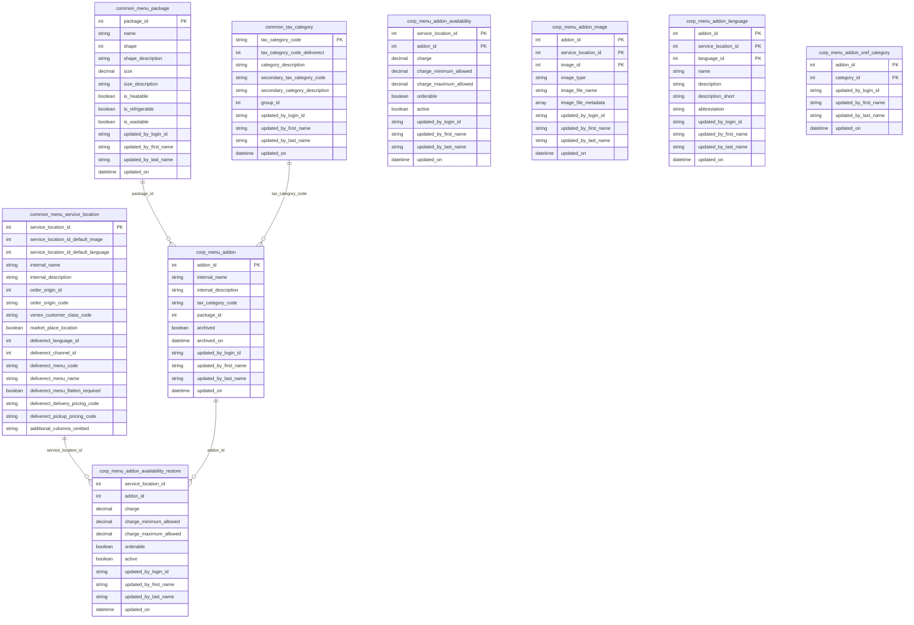

# menu-publisher - corporate-menu 1

```mermaid
erDiagram
    common_menu_package {
        int package_id PK
        string name
        int shape
        string shape_description
        decimal size
        string size_description
        boolean is_heatable
        boolean is_refrigerable
        boolean is_wastable
        string updated_by_login_id
        string updated_by_first_name
        string updated_by_last_name
        datetime updated_on
    }
    common_menu_service_location {
        int service_location_id PK
        int service_location_id_default_image
        int service_location_id_default_language
        string internal_name
        string internal_description
        int order_origin_id
        string order_origin_code
        string vertex_customer_class_code
        boolean market_place_location
        int deliverect_language_id
        int deliverect_channel_id
        string deliverect_menu_code
        string deliverect_menu_name
        boolean deliverect_menu_flatten_required
        string deliverect_delivery_pricing_code
        string deliverect_pickup_pricing_code
        string additional_columns_omitted
    }
    common_tax_category {
        string tax_category_code PK
        int tax_category_code_deliverect
        string category_description
        string secondary_tax_category_code
        string secondary_category_description
        int group_id
        string updated_by_login_id
        string updated_by_first_name
        string updated_by_last_name
        datetime updated_on
    }
    corp_menu_addon {
        int addon_id PK
        string internal_name
        string internal_description
        string tax_category_code
        int package_id
        boolean archived
        datetime archived_on
        string updated_by_login_id
        string updated_by_first_name
        string updated_by_last_name
        datetime updated_on
    }
    corp_menu_addon_availability {
        int service_location_id PK
        int addon_id PK
        decimal charge
        decimal charge_minimum_allowed
        decimal charge_maximum_allowed
        boolean orderable
        boolean active
        string updated_by_login_id
        string updated_by_first_name
        string updated_by_last_name
        datetime updated_on
    }
    corp_menu_addon_availability_restore {
        int service_location_id
        int addon_id
        decimal charge
        decimal charge_minimum_allowed
        decimal charge_maximum_allowed
        boolean orderable
        boolean active
        string updated_by_login_id
        string updated_by_first_name
        string updated_by_last_name
        datetime updated_on
    }
    corp_menu_addon_image {
        int addon_id PK
        int service_location_id PK
        int image_id PK
        string image_type
        string image_file_name
        array image_file_metadata
        string updated_by_login_id
        string updated_by_first_name
        string updated_by_last_name
        datetime updated_on
    }
    corp_menu_addon_language {
        int addon_id PK
        int service_location_id PK
        int language_id PK
        string name
        string description
        string description_short
        string abbreviation
        string updated_by_login_id
        string updated_by_first_name
        string updated_by_last_name
        datetime updated_on
    }
    corp_menu_addon_xref_category {
        int addon_id PK
        int category_id PK
        string updated_by_login_id
        string updated_by_first_name
        string updated_by_last_name
        datetime updated_on
    }
    common_menu_package ||--o{ corp_menu_addon : package_id
    common_menu_service_location ||--o{ corp_menu_addon_availability_restore : service_location_id
    common_tax_category ||--o{ corp_menu_addon : tax_category_code
    corp_menu_addon ||--o{ corp_menu_addon_availability_restore : addon_id
```
