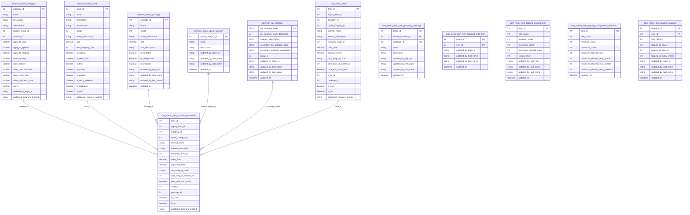

# menu-publisher - corporate-menu 6

```mermaid
erDiagram
    common_menu_category {
        int category_id PK
        string name
        string description
        string abbreviation
        int display_group_id
        int account_id
        boolean apply_to_item
        boolean apply_to_special
        boolean apply_to_topping
        boolean allow_topping
        boolean allow_addon
        boolean allow_customization
        boolean allow_oven_time
        boolean allow_expiration_time
        boolean active
        string updated_by_login_id
        string additional_columns_omitted
    }
    common_menu_crust {
        int crust_id PK
        string name
        string description
        string abbreviation
        int shape
        string shape_description
        decimal size
        int item_mapping_size
        boolean is_regular
        boolean is_deep_dish
        boolean is_thin
        boolean is_stuffed
        boolean is_pretzel
        boolean is_using_sheetout
        boolean is_parbaked
        boolean is_half
        string additional_columns_omitted
    }
    common_menu_package {
        int package_id PK
        string name
        int shape
        string shape_description
        decimal size
        string size_description
        boolean is_heatable
        boolean is_refrigerable
        boolean is_wastable
        string updated_by_login_id
        string updated_by_first_name
        string updated_by_last_name
        datetime updated_on
    }
    common_menu_upsell_category {
        int upsell_category_id PK
        string name
        string description
        string updated_by_login_id
        string updated_by_first_name
        string updated_by_last_name
        datetime updated_on
    }
    common_tax_category {
        string tax_category_code PK
        int tax_category_code_deliverect
        string category_description
        string secondary_tax_category_code
        string secondary_category_description
        int group_id
        string updated_by_login_id
        string updated_by_first_name
        string updated_by_last_name
        datetime updated_on
    }
    corp_menu_item {
        int item_id PK
        int legacy_item_id
        int category_id
        int upsell_category_id
        string internal_name
        string internal_description
        int hierarchy_level_id
        decimal oven_time
        decimal expiration_time
        string tax_category_code
        int core_map_to_custom_id
        boolean print_and_scan_label
        int crust_id
        int package_id
        boolean is_core
        boolean is_lto
        string additional_columns_omitted
    }
    corp_menu_item_size_grouping_language {
        int group_id PK
        int service_location_id PK
        int language_id PK
        string name
        string description
        string updated_by_login_id
        string updated_by_first_name
        string updated_by_last_name
        datetime updated_on
    }
    corp_menu_item_size_grouping_xref_item {
        int group_id PK
        int item_id PK
        string updated_by_login_id
        string updated_by_first_name
        string updated_by_last_name
        datetime updated_on
    }
    corp_menu_item_snapshot_20260302 {
        int item_id
        int legacy_item_id
        int category_id
        int upsell_category_id
        string internal_name
        string internal_description
        int hierarchy_level_id
        decimal oven_time
        decimal expiration_time
        string tax_category_code
        int core_map_to_custom_id
        boolean print_and_scan_label
        int crust_id
        int package_id
        boolean is_core
        boolean is_lto
        string additional_columns_omitted
    }
    corp_menu_item_topping_configuration {
        int item_id PK
        int free_count
        int minimum_count
        int maximum_count
        int maximum_charged_count
        int regular_level
        string updated_by_login_id
        string updated_by_first_name
        string updated_by_last_name
        datetime updated_on
    }
    corp_menu_item_topping_configuration_deliverect {
        int item_id PK
        int free_count
        int minimum_count
        int maximum_count
        int maximum_allowed_level
        int maximum_allowed_level_sauce
        int maximum_allowed_level_cheese
        int maximum_allowed_level_premium
        datetime updated_on
    }
    corp_menu_item_topping_mapping {
        int mapping_id PK
        int item_id PK
        int item_priority
        int topping_id_sauce
        int topping_id_chesse
        int topping_id_extra_chesse
        string updated_by_login_id
        string updated_by_first_name
        string updated_by_last_name
        datetime updated_on
    }
    common_menu_category ||--o{ corp_menu_item_snapshot_20260302 : category_id
    common_menu_crust ||--o{ corp_menu_item_snapshot_20260302 : crust_id
    common_menu_package ||--o{ corp_menu_item_snapshot_20260302 : package_id
    common_menu_upsell_category ||--o{ corp_menu_item_snapshot_20260302 : upsell_category_id
    common_tax_category ||--o{ corp_menu_item_snapshot_20260302 : tax_category_code
    corp_menu_item ||--o{ corp_menu_item_snapshot_20260302 : item_id
```
