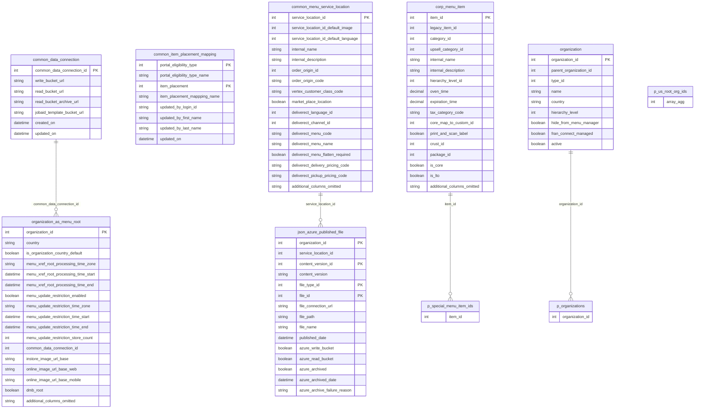

# menu-publisher - miscellaneous 1

```mermaid
erDiagram
    common_data_connection {
        int common_data_connection_id PK
        string write_bucket_url
        string read_bucket_url
        string read_bucket_archive_url
        string jobaid_template_bucket_url
        datetime created_on
        datetime updated_on
    }
    common_item_placement_mapping {
        int portal_eligibility_type PK
        string portal_eligibility_type_name
        int item_placement PK
        string item_placement_mappping_name
        string updated_by_login_id
        string updated_by_first_name
        string updated_by_last_name
        datetime updated_on
    }
    common_menu_service_location {
        int service_location_id PK
        int service_location_id_default_image
        int service_location_id_default_language
        string internal_name
        string internal_description
        int order_origin_id
        string order_origin_code
        string vertex_customer_class_code
        boolean market_place_location
        int deliverect_language_id
        int deliverect_channel_id
        string deliverect_menu_code
        string deliverect_menu_name
        boolean deliverect_menu_flatten_required
        string deliverect_delivery_pricing_code
        string deliverect_pickup_pricing_code
        string additional_columns_omitted
    }
    corp_menu_item {
        int item_id PK
        int legacy_item_id
        int category_id
        int upsell_category_id
        string internal_name
        string internal_description
        int hierarchy_level_id
        decimal oven_time
        decimal expiration_time
        string tax_category_code
        int core_map_to_custom_id
        boolean print_and_scan_label
        int crust_id
        int package_id
        boolean is_core
        boolean is_lto
        string additional_columns_omitted
    }
    json_azure_published_file {
        int organization_id PK
        int service_location_id
        int content_version_id PK
        string content_version
        int file_type_id PK
        int file_id PK
        string file_connection_url
        string file_path
        string file_name
        datetime published_date
        boolean azure_write_bucket
        boolean azure_read_bucket
        boolean azure_archived
        datetime azure_archived_date
        string azure_archive_failure_reason
    }
    organization {
        int organization_id PK
        int parent_organization_id
        int type_id
        string name
        string country
        int hierarchy_level
        boolean hide_from_menu_manager
        boolean fran_connect_managed
        boolean active
    }
    organization_as_menu_root {
        int organization_id PK
        string country
        boolean is_organization_country_default
        string menu_xref_root_processing_time_zone
        datetime menu_xref_root_processing_time_start
        datetime menu_xref_root_processing_time_end
        boolean menu_update_restriction_enabled
        string menu_update_restriction_time_zone
        datetime menu_update_restriction_time_start
        datetime menu_update_restriction_time_end
        int menu_update_restriction_store_count
        int common_data_connection_id
        string instore_image_url_base
        string online_image_url_base_web
        string online_image_url_base_mobile
        boolean dmb_root
        string additional_columns_omitted
    }
    p_organizations {
        int organization_id
    }
    p_special_menu_item_ids {
        int item_id
    }
    p_us_root_org_ids {
        int array_agg
    }
    common_data_connection ||--o{ organization_as_menu_root : common_data_connection_id
    common_menu_service_location ||--o{ json_azure_published_file : service_location_id
    corp_menu_item ||--o{ p_special_menu_item_ids : item_id
    organization ||--o{ p_organizations : organization_id
```
