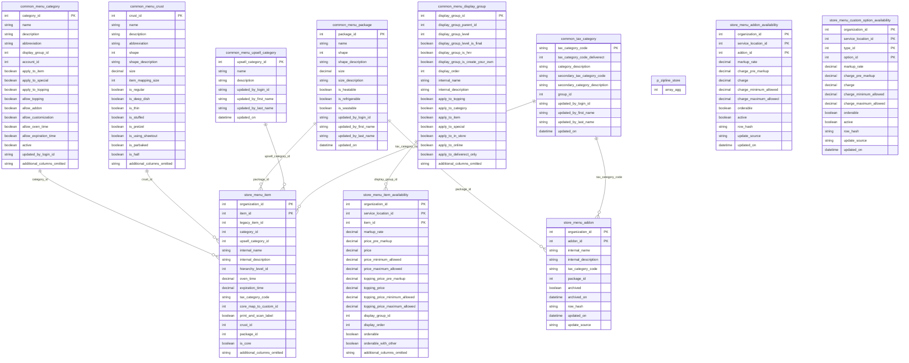

# menu-publisher - miscellaneous 2

```mermaid
erDiagram
    common_menu_category {
        int category_id PK
        string name
        string description
        string abbreviation
        int display_group_id
        int account_id
        boolean apply_to_item
        boolean apply_to_special
        boolean apply_to_topping
        boolean allow_topping
        boolean allow_addon
        boolean allow_customization
        boolean allow_oven_time
        boolean allow_expiration_time
        boolean active
        string updated_by_login_id
        string additional_columns_omitted
    }
    common_menu_crust {
        int crust_id PK
        string name
        string description
        string abbreviation
        int shape
        string shape_description
        decimal size
        int item_mapping_size
        boolean is_regular
        boolean is_deep_dish
        boolean is_thin
        boolean is_stuffed
        boolean is_pretzel
        boolean is_using_sheetout
        boolean is_parbaked
        boolean is_half
        string additional_columns_omitted
    }
    common_menu_display_group {
        int display_group_id PK
        int display_group_parent_id
        int display_group_level
        boolean display_group_level_is_final
        boolean display_group_is_hnr
        boolean display_group_is_create_your_own
        int display_order
        string internal_name
        string internal_description
        boolean apply_to_topping
        boolean apply_to_category
        boolean apply_to_item
        boolean apply_to_special
        boolean apply_to_in_store
        boolean apply_to_online
        boolean apply_to_deliverect_only
        string additional_columns_omitted
    }
    common_menu_package {
        int package_id PK
        string name
        int shape
        string shape_description
        decimal size
        string size_description
        boolean is_heatable
        boolean is_refrigerable
        boolean is_wastable
        string updated_by_login_id
        string updated_by_first_name
        string updated_by_last_name
        datetime updated_on
    }
    common_menu_upsell_category {
        int upsell_category_id PK
        string name
        string description
        string updated_by_login_id
        string updated_by_first_name
        string updated_by_last_name
        datetime updated_on
    }
    common_tax_category {
        string tax_category_code PK
        int tax_category_code_deliverect
        string category_description
        string secondary_tax_category_code
        string secondary_category_description
        int group_id
        string updated_by_login_id
        string updated_by_first_name
        string updated_by_last_name
        datetime updated_on
    }
    p_zipline_store {
        int array_agg
    }
    store_menu_addon {
        int organization_id PK
        int addon_id PK
        string internal_name
        string internal_description
        string tax_category_code
        int package_id
        boolean archived
        datetime archived_on
        string row_hash
        datetime updated_on
        string update_source
    }
    store_menu_addon_availability {
        int organization_id PK
        int service_location_id PK
        int addon_id PK
        decimal markup_rate
        decimal charge_pre_markup
        decimal charge
        decimal charge_minimum_allowed
        decimal charge_maximum_allowed
        boolean orderable
        boolean active
        string row_hash
        string update_source
        datetime updated_on
    }
    store_menu_custom_option_availability {
        int organization_id PK
        int service_location_id PK
        int type_id PK
        int option_id PK
        decimal markup_rate
        decimal charge_pre_markup
        decimal charge
        decimal charge_minimum_allowed
        decimal charge_maximum_allowed
        boolean orderable
        boolean active
        string row_hash
        string update_source
        datetime updated_on
    }
    store_menu_item {
        int organization_id PK
        int item_id PK
        int legacy_item_id
        int category_id
        int upsell_category_id
        string internal_name
        string internal_description
        int hierarchy_level_id
        decimal oven_time
        decimal expiration_time
        string tax_category_code
        int core_map_to_custom_id
        boolean print_and_scan_label
        int crust_id
        int package_id
        boolean is_core
        string additional_columns_omitted
    }
    store_menu_item_availability {
        int organization_id PK
        int service_location_id PK
        int item_id PK
        decimal markup_rate
        decimal price_pre_markup
        decimal price
        decimal price_minimum_allowed
        decimal price_maximum_allowed
        decimal topping_price_pre_markup
        decimal topping_price
        decimal topping_price_minimum_allowed
        decimal topping_price_maximum_allowed
        int display_group_id
        int display_order
        boolean orderable
        boolean orderable_with_other
        string additional_columns_omitted
    }
    common_menu_category ||--o{ store_menu_item : category_id
    common_menu_crust ||--o{ store_menu_item : crust_id
    common_menu_display_group ||--o{ store_menu_item_availability : display_group_id
    common_menu_package ||--o{ store_menu_addon : package_id
    common_menu_package ||--o{ store_menu_item : package_id
    common_menu_upsell_category ||--o{ store_menu_item : upsell_category_id
    common_tax_category ||--o{ store_menu_addon : tax_category_code
    common_tax_category ||--o{ store_menu_item : tax_category_code
```
