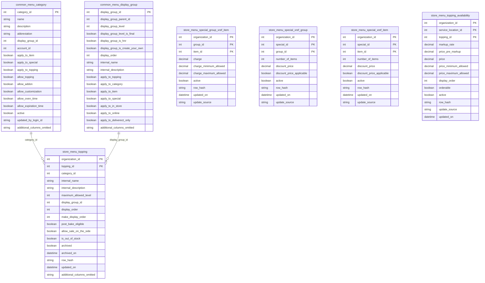

# menu-publisher - miscellaneous 4

```mermaid
erDiagram
    common_menu_category {
        int category_id PK
        string name
        string description
        string abbreviation
        int display_group_id
        int account_id
        boolean apply_to_item
        boolean apply_to_special
        boolean apply_to_topping
        boolean allow_topping
        boolean allow_addon
        boolean allow_customization
        boolean allow_oven_time
        boolean allow_expiration_time
        boolean active
        string updated_by_login_id
        string additional_columns_omitted
    }
    common_menu_display_group {
        int display_group_id PK
        int display_group_parent_id
        int display_group_level
        boolean display_group_level_is_final
        boolean display_group_is_hnr
        boolean display_group_is_create_your_own
        int display_order
        string internal_name
        string internal_description
        boolean apply_to_topping
        boolean apply_to_category
        boolean apply_to_item
        boolean apply_to_special
        boolean apply_to_in_store
        boolean apply_to_online
        boolean apply_to_deliverect_only
        string additional_columns_omitted
    }
    store_menu_special_group_xref_item {
        int organization_id PK
        int group_id PK
        int item_id PK
        decimal charge
        decimal charge_minimum_allowed
        decimal charge_maximum_allowed
        boolean active
        string row_hash
        datetime updated_on
        string update_source
    }
    store_menu_special_xref_group {
        int organization_id PK
        int special_id PK
        int group_id PK
        int number_of_items
        decimal discount_price
        boolean discount_price_applicable
        boolean active
        string row_hash
        datetime updated_on
        string update_source
    }
    store_menu_special_xref_item {
        int organization_id PK
        int special_id PK
        int item_id PK
        int number_of_items
        decimal discount_price
        boolean discount_price_applicable
        boolean active
        string row_hash
        datetime updated_on
        string update_source
    }
    store_menu_topping {
        int organization_id PK
        int topping_id PK
        int category_id
        string internal_name
        string internal_description
        int maximum_allowed_level
        int display_group_id
        int display_order
        int make_display_order
        boolean post_bake_eligible
        boolean allow_sale_on_the_side
        boolean is_out_of_stock
        boolean archived
        datetime archived_on
        string row_hash
        datetime updated_on
        string additional_columns_omitted
    }
    store_menu_topping_availability {
        int organization_id PK
        int service_location_id PK
        int topping_id PK
        decimal markup_rate
        decimal price_pre_markup
        decimal price
        decimal price_minimum_allowed
        decimal price_maximum_allowed
        int display_order
        boolean orderable
        boolean active
        string row_hash
        string update_source
        datetime updated_on
    }
    common_menu_category ||--o{ store_menu_topping : category_id
    common_menu_display_group ||--o{ store_menu_topping : display_group_id
```
