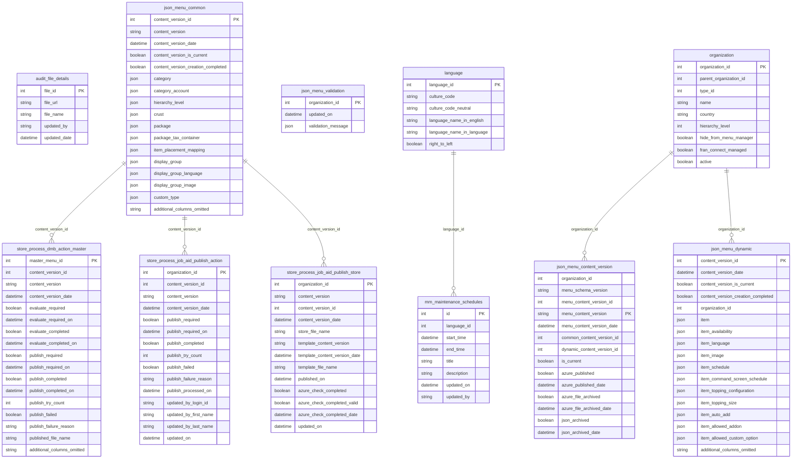

# menu-publisher - operations-audit-process 1

```mermaid
erDiagram
    audit_file_details {
        int file_id PK
        string file_url
        string file_name
        string updated_by
        datetime updated_date
    }
    json_menu_common {
        int content_version_id PK
        string content_version
        datetime content_version_date
        boolean content_version_is_current
        boolean content_version_creation_completed
        json category
        json category_account
        json hierarchy_level
        json crust
        json package
        json package_tax_container
        json item_placement_mapping
        json display_group
        json display_group_language
        json display_group_image
        json custom_type
        string additional_columns_omitted
    }
    json_menu_content_version {
        int organization_id
        string menu_schema_version
        int menu_content_version_id
        string menu_content_version PK
        datetime menu_content_version_date
        int common_content_version_id
        int dynamic_content_version_id
        boolean is_current
        boolean azure_published
        datetime azure_published_date
        boolean azure_file_archived
        datetime azure_file_archived_date
        boolean json_archived
        datetime json_archived_date
    }
    json_menu_dynamic {
        int content_version_id PK
        datetime content_version_date
        boolean content_version_is_current
        boolean content_version_creation_completed
        int organization_id
        json item
        json item_availability
        json item_language
        json item_image
        json item_schedule
        json item_command_screen_schedule
        json item_topping_configuration
        json item_topping_size
        json item_auto_add
        json item_allowed_addon
        json item_allowed_custom_option
        string additional_columns_omitted
    }
    json_menu_validation {
        int organization_id PK
        datetime updated_on
        json validation_message
    }
    language {
        int language_id PK
        string culture_code
        string culture_code_neutral
        string language_name_in_english
        string language_name_in_language
        boolean right_to_left
    }
    mm_maintenance_schedules {
        int id PK
        int language_id
        datetime start_time
        datetime end_time
        string title
        string description
        datetime updated_on
        string updated_by
    }
    organization {
        int organization_id PK
        int parent_organization_id
        int type_id
        string name
        string country
        int hierarchy_level
        boolean hide_from_menu_manager
        boolean fran_connect_managed
        boolean active
    }
    store_process_dmb_action_master {
        int master_menu_id PK
        int content_version_id
        string content_version
        datetime content_version_date
        boolean evaluate_required
        datetime evaluate_required_on
        boolean evaluate_completed
        datetime evaluate_completed_on
        boolean publish_required
        datetime publish_required_on
        boolean publish_completed
        datetime publish_completed_on
        int publish_try_count
        boolean publish_failed
        string publish_failure_reason
        string published_file_name
        string additional_columns_omitted
    }
    store_process_job_aid_publish_action {
        int organization_id PK
        int content_version_id
        string content_version
        datetime content_version_date
        boolean publish_required
        datetime publish_required_on
        boolean publish_completed
        int publish_try_count
        boolean publish_failed
        string publish_failure_reason
        datetime publish_processed_on
        string updated_by_login_id
        string updated_by_first_name
        string updated_by_last_name
        datetime updated_on
    }
    store_process_job_aid_publish_store {
        int organization_id PK
        string content_version
        int content_version_id
        datetime content_version_date
        string store_file_name
        string template_content_version
        datetime template_content_version_date
        string template_file_name
        datetime published_on
        boolean azure_check_completed
        boolean azure_check_completed_valid
        datetime azure_check_completed_date
        datetime updated_on
    }
    json_menu_common ||--o{ store_process_dmb_action_master : content_version_id
    json_menu_common ||--o{ store_process_job_aid_publish_action : content_version_id
    json_menu_common ||--o{ store_process_job_aid_publish_store : content_version_id
    language ||--o{ mm_maintenance_schedules : language_id
    organization ||--o{ json_menu_content_version : organization_id
    organization ||--o{ json_menu_dynamic : organization_id
```
