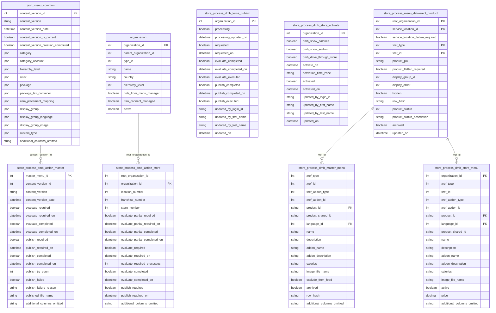

# menu-publisher - operations-audit-process 2

```mermaid
erDiagram
    json_menu_common {
        int content_version_id PK
        string content_version
        datetime content_version_date
        boolean content_version_is_current
        boolean content_version_creation_completed
        json category
        json category_account
        json hierarchy_level
        json crust
        json package
        json package_tax_container
        json item_placement_mapping
        json display_group
        json display_group_language
        json display_group_image
        json custom_type
        string additional_columns_omitted
    }
    organization {
        int organization_id PK
        int parent_organization_id
        int type_id
        string name
        string country
        int hierarchy_level
        boolean hide_from_menu_manager
        boolean fran_connect_managed
        boolean active
    }
    store_process_dmb_action_master {
        int master_menu_id PK
        int content_version_id
        string content_version
        datetime content_version_date
        boolean evaluate_required
        datetime evaluate_required_on
        boolean evaluate_completed
        datetime evaluate_completed_on
        boolean publish_required
        datetime publish_required_on
        boolean publish_completed
        datetime publish_completed_on
        int publish_try_count
        boolean publish_failed
        string publish_failure_reason
        string published_file_name
        string additional_columns_omitted
    }
    store_process_dmb_action_store {
        int root_organization_id
        int organization_id PK
        int location_number
        int franchise_number
        int store_number
        boolean evaluate_partial_required
        datetime evaluate_partial_required_on
        boolean evaluate_partial_completed
        datetime evaluate_partial_completed_on
        boolean evaluate_required
        datetime evaluate_required_on
        int evaluate_required_processes
        boolean evaluate_completed
        datetime evaluate_completed_on
        boolean publish_required
        datetime publish_required_on
        string additional_columns_omitted
    }
    store_process_dmb_force_publish {
        int organization_id PK
        boolean processing
        datetime processing_updated_on
        boolean requested
        datetime requested_on
        boolean evaluate_completed
        datetime evaluate_completed_on
        boolean evaluate_executed
        boolean publish_completed
        datetime publish_completed_on
        boolean publish_executed
        string updated_by_login_id
        string updated_by_first_name
        string updated_by_last_name
        datetime updated_on
    }
    store_process_dmb_master_menu {
        int xref_type
        int xref_id
        int xref_addon_type
        int xref_addon_id
        string product_id PK
        string product_shared_id
        int language_id PK
        string name
        string description
        string addon_name
        string addon_description
        string calories
        string image_file_name
        boolean exclude_from_feed
        boolean archived
        string row_hash
        string additional_columns_omitted
    }
    store_process_dmb_store_activate {
        int organization_id PK
        boolean dmb_show_calories
        boolean dmb_show_sodium
        boolean dmb_drive_through_store
        datetime activate_on
        string activation_time_zone
        boolean activated
        datetime activated_on
        string updated_by_login_id
        string updated_by_first_name
        string updated_by_last_name
        datetime updated_on
    }
    store_process_dmb_store_menu {
        int organization_id PK
        int xref_type
        int xref_id
        int xref_addon_type
        int xref_addon_id
        string product_id PK
        int language_id PK
        string product_shared_id
        string name
        string description
        string addon_name
        string addon_description
        string calories
        string image_file_name
        boolean active
        decimal price
        string additional_columns_omitted
    }
    store_process_menu_deliverect_product {
        int root_organization_id PK
        int service_location_id PK
        boolean service_location_flatten_required
        int xref_type PK
        int xref_id PK
        string product_plu
        boolean product_flatten_required
        int display_group_id
        int display_order
        boolean hidden
        string row_hash
        int product_status
        string product_status_description
        boolean archived
        datetime updated_on
    }
    json_menu_common ||--o{ store_process_dmb_action_master : content_version_id
    organization ||--o{ store_process_dmb_action_store : root_organization_id
    store_process_menu_deliverect_product ||--o{ store_process_dmb_master_menu : xref_id
    store_process_menu_deliverect_product ||--o{ store_process_dmb_store_menu : xref_id
```
