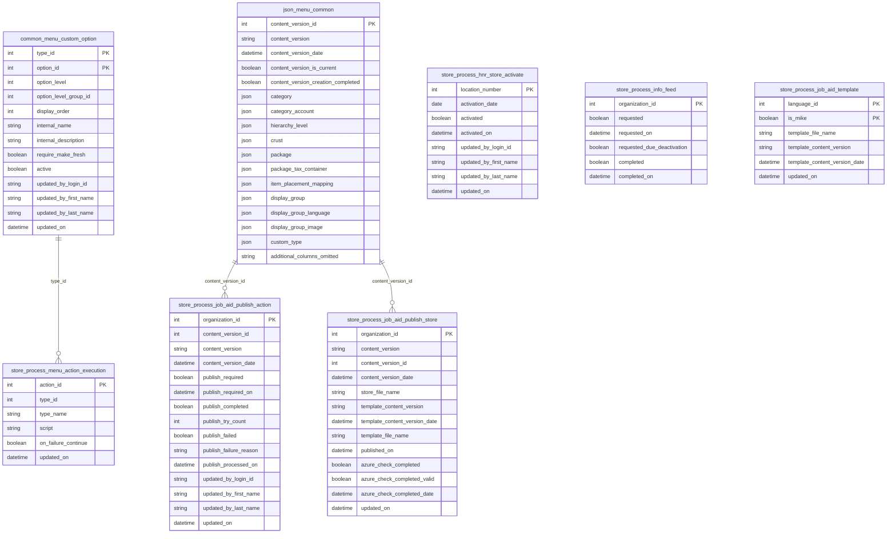

# menu-publisher - operations-audit-process 3

```mermaid
erDiagram
    common_menu_custom_option {
        int type_id PK
        int option_id PK
        int option_level
        int option_level_group_id
        int display_order
        string internal_name
        string internal_description
        boolean require_make_fresh
        boolean active
        string updated_by_login_id
        string updated_by_first_name
        string updated_by_last_name
        datetime updated_on
    }
    json_menu_common {
        int content_version_id PK
        string content_version
        datetime content_version_date
        boolean content_version_is_current
        boolean content_version_creation_completed
        json category
        json category_account
        json hierarchy_level
        json crust
        json package
        json package_tax_container
        json item_placement_mapping
        json display_group
        json display_group_language
        json display_group_image
        json custom_type
        string additional_columns_omitted
    }
    store_process_hnr_store_activate {
        int location_number PK
        date activation_date
        boolean activated
        datetime activated_on
        string updated_by_login_id
        string updated_by_first_name
        string updated_by_last_name
        datetime updated_on
    }
    store_process_info_feed {
        int organization_id PK
        boolean requested
        datetime requested_on
        boolean requested_due_deactivation
        boolean completed
        datetime completed_on
    }
    store_process_job_aid_publish_action {
        int organization_id PK
        int content_version_id
        string content_version
        datetime content_version_date
        boolean publish_required
        datetime publish_required_on
        boolean publish_completed
        int publish_try_count
        boolean publish_failed
        string publish_failure_reason
        datetime publish_processed_on
        string updated_by_login_id
        string updated_by_first_name
        string updated_by_last_name
        datetime updated_on
    }
    store_process_job_aid_publish_store {
        int organization_id PK
        string content_version
        int content_version_id
        datetime content_version_date
        string store_file_name
        string template_content_version
        datetime template_content_version_date
        string template_file_name
        datetime published_on
        boolean azure_check_completed
        boolean azure_check_completed_valid
        datetime azure_check_completed_date
        datetime updated_on
    }
    store_process_job_aid_template {
        int language_id PK
        boolean is_mike PK
        string template_file_name
        string template_content_version
        datetime template_content_version_date
        datetime updated_on
    }
    store_process_menu_action_execution {
        int action_id PK
        int type_id
        string type_name
        string script
        boolean on_failure_continue
        datetime updated_on
    }
    common_menu_custom_option ||--o{ store_process_menu_action_execution : type_id
    json_menu_common ||--o{ store_process_job_aid_publish_action : content_version_id
    json_menu_common ||--o{ store_process_job_aid_publish_store : content_version_id
```
