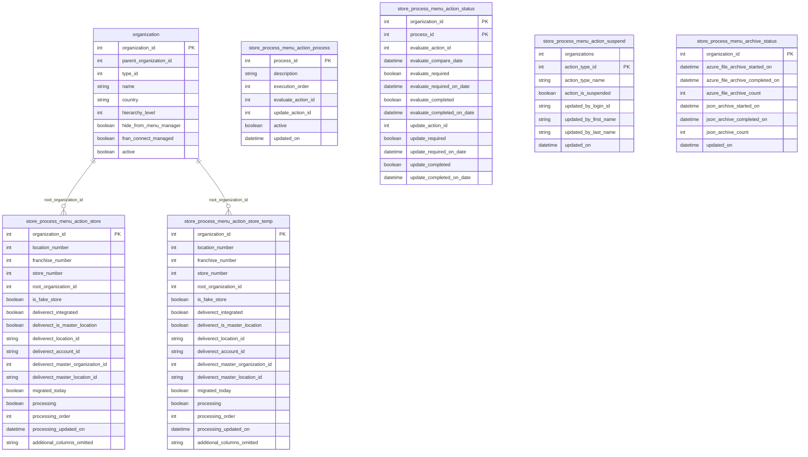

# menu-publisher - operations-audit-process 4

```mermaid
erDiagram
    organization {
        int organization_id PK
        int parent_organization_id
        int type_id
        string name
        string country
        int hierarchy_level
        boolean hide_from_menu_manager
        boolean fran_connect_managed
        boolean active
    }
    store_process_menu_action_process {
        int process_id PK
        string description
        int execution_order
        int evaluate_action_id
        int update_action_id
        boolean active
        datetime updated_on
    }
    store_process_menu_action_status {
        int organization_id PK
        int process_id PK
        int evaluate_action_id
        datetime evaluate_compare_date
        boolean evaluate_required
        datetime evaluate_required_on_date
        boolean evaluate_completed
        datetime evaluate_completed_on_date
        int update_action_id
        boolean update_required
        datetime update_required_on_date
        boolean update_completed
        datetime update_completed_on_date
    }
    store_process_menu_action_store {
        int organization_id PK
        int location_number
        int franchise_number
        int store_number
        int root_organization_id
        boolean is_fake_store
        boolean deliverect_integrated
        boolean deliverect_is_master_location
        string deliverect_location_id
        string deliverect_account_id
        int deliverect_master_organization_id
        string deliverect_master_location_id
        boolean migrated_today
        boolean processing
        int processing_order
        datetime processing_updated_on
        string additional_columns_omitted
    }
    store_process_menu_action_store_temp {
        int organization_id PK
        int location_number
        int franchise_number
        int store_number
        int root_organization_id
        boolean is_fake_store
        boolean deliverect_integrated
        boolean deliverect_is_master_location
        string deliverect_location_id
        string deliverect_account_id
        int deliverect_master_organization_id
        string deliverect_master_location_id
        boolean migrated_today
        boolean processing
        int processing_order
        datetime processing_updated_on
        string additional_columns_omitted
    }
    store_process_menu_action_suspend {
        int organizations
        int action_type_id PK
        string action_type_name
        boolean action_is_suspended
        string updated_by_login_id
        string updated_by_first_name
        string updated_by_last_name
        datetime updated_on
    }
    store_process_menu_archive_status {
        int organization_id PK
        datetime azure_file_archive_started_on
        datetime azure_file_archive_completed_on
        int azure_file_archive_count
        datetime json_archive_started_on
        datetime json_archive_completed_on
        int json_archive_count
        datetime updated_on
    }
    organization ||--o{ store_process_menu_action_store : root_organization_id
    organization ||--o{ store_process_menu_action_store_temp : root_organization_id
```
