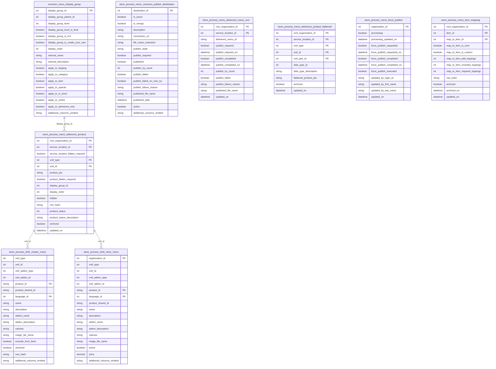

# menu-publisher - operations-audit-process 5

```mermaid
erDiagram
    common_menu_display_group {
        int display_group_id PK
        int display_group_parent_id
        int display_group_level
        boolean display_group_level_is_final
        boolean display_group_is_hnr
        boolean display_group_is_create_your_own
        int display_order
        string internal_name
        string internal_description
        boolean apply_to_topping
        boolean apply_to_category
        boolean apply_to_item
        boolean apply_to_special
        boolean apply_to_in_store
        boolean apply_to_online
        boolean apply_to_deliverect_only
        string additional_columns_omitted
    }
    store_process_dmb_master_menu {
        int xref_type
        int xref_id
        int xref_addon_type
        int xref_addon_id
        string product_id PK
        string product_shared_id
        int language_id PK
        string name
        string description
        string addon_name
        string addon_description
        string calories
        string image_file_name
        boolean exclude_from_feed
        boolean archived
        string row_hash
        string additional_columns_omitted
    }
    store_process_dmb_store_menu {
        int organization_id PK
        int xref_type
        int xref_id
        int xref_addon_type
        int xref_addon_id
        string product_id PK
        int language_id PK
        string product_shared_id
        string name
        string description
        string addon_name
        string addon_description
        string calories
        string image_file_name
        boolean active
        decimal price
        string additional_columns_omitted
    }
    store_process_menu_common_publish_destination {
        int destination_id PK
        boolean is_azure
        boolean is_mongo
        string description
        string connection_url
        string file_name_extension
        string publish_state
        boolean publish_required
        boolean published
        int publish_try_count
        boolean publish_failed
        boolean publish_failed_on_max_try
        string publish_failure_reason
        string published_file_name
        datetime published_date
        boolean active
        string additional_columns_omitted
    }
    store_process_menu_deliverect_menu_root {
        int root_organization_id PK
        int service_location_id PK
        string deliverect_menu_id
        boolean publish_required
        datetime publish_required_on
        boolean publish_completed
        datetime publish_completed_on
        int publish_try_count
        boolean publish_failed
        string publish_failure_reason
        string published_file_name
        datetime updated_on
    }
    store_process_menu_deliverect_product {
        int root_organization_id PK
        int service_location_id PK
        boolean service_location_flatten_required
        int xref_type PK
        int xref_id PK
        string product_plu
        boolean product_flatten_required
        int display_group_id
        int display_order
        boolean hidden
        string row_hash
        int product_status
        string product_status_description
        boolean archived
        datetime updated_on
    }
    store_process_menu_deliverect_product_flattened {
        int root_organization_id PK
        int service_location_id PK
        int xref_type PK
        int xref_id PK
        int xref_part_id PK
        int data_type_id
        string data_type_description
        string flattened_product_plu
        boolean archived
        datetime updated_on
    }
    store_process_menu_force_publish {
        int organization_id PK
        boolean processing
        datetime processing_updated_on
        boolean force_publish_requested
        datetime force_publish_requested_on
        boolean force_publish_completed
        datetime force_publish_completed_on
        boolean force_publish_executed
        string updated_by_login_id
        string updated_by_first_name
        string updated_by_last_name
        datetime updated_on
    }
    store_process_menu_item_mapping {
        int root_organization_id PK
        int item_id PK
        int map_to_item_id PK
        boolean map_to_item_is_core
        boolean map_to_item_is_custom
        int map_to_item_add_toppings
        int map_to_item_included_toppings
        int map_to_item_required_toppings
        string row_hash
        boolean archived
        datetime archived_on
        datetime updated_on
    }
    common_menu_display_group ||--o{ store_process_menu_deliverect_product : display_group_id
    store_process_menu_deliverect_product ||--o{ store_process_dmb_master_menu : xref_id
    store_process_menu_deliverect_product ||--o{ store_process_dmb_store_menu : xref_id
```
