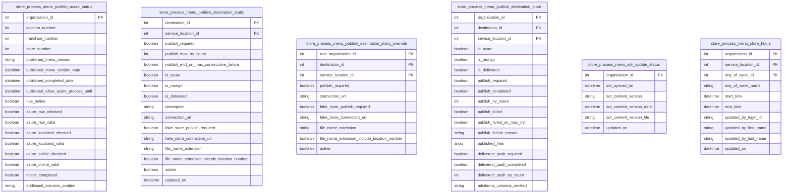

# menu-publisher - operations-audit-process 6

```mermaid
erDiagram
    store_process_menu_publish_azure_status {
        int organization_id PK
        int location_number
        int franchise_number
        int store_number
        string published_menu_version
        datetime published_menu_version_date
        datetime published_completed_date
        datetime published_allow_azure_process_until
        boolean has_online
        boolean azure_raw_checked
        boolean azure_raw_valid
        boolean azure_localized_checked
        boolean azure_localized_valid
        boolean azure_online_checked
        boolean azure_online_valid
        boolean check_completed
        string additional_columns_omitted
    }
    store_process_menu_publish_destination_static {
        int destination_id PK
        int service_location_id PK
        boolean publish_required
        int publish_max_try_count
        boolean publish_end_on_max_consecutive_failure
        boolean is_azure
        boolean is_mongo
        boolean is_deliverect
        string description
        string connection_url
        boolean fake_store_publish_required
        string fake_store_connection_url
        string file_name_extension
        boolean file_name_extension_include_location_number
        boolean active
        datetime updated_on
    }
    store_process_menu_publish_destination_static_override {
        int root_organization_id PK
        int destination_id PK
        int service_location_id PK
        boolean publish_required
        string connection_url
        boolean fake_store_publish_required
        string fake_store_connection_url
        string file_name_extension
        boolean file_name_extension_include_location_number
        boolean active
    }
    store_process_menu_publish_destination_store {
        int organization_id PK
        int destination_id PK
        int service_location_id PK
        boolean is_azure
        boolean is_mongo
        boolean is_deliverect
        boolean publish_required
        boolean publish_completed
        int publish_try_count
        boolean publish_failed
        boolean publish_failed_on_max_try
        string publish_failure_reason
        array published_files
        boolean deliverect_push_required
        boolean deliverect_push_completed
        int deliverect_push_try_count
        string additional_columns_omitted
    }
    store_process_menu_sdr_update_status {
        int organization_id PK
        datetime sdr_synced_on
        string sdr_content_version
        datetime sdr_content_version_date
        string sdr_content_version_file
        datetime updated_on
    }
    store_process_menu_store_hours {
        int organization_id PK
        int service_location_id PK
        int day_of_week_id PK
        string day_of_week_name
        datetime start_time
        datetime end_time
        string updated_by_login_id
        string updated_by_first_name
        string updated_by_last_name
        datetime updated_on
    }
```
