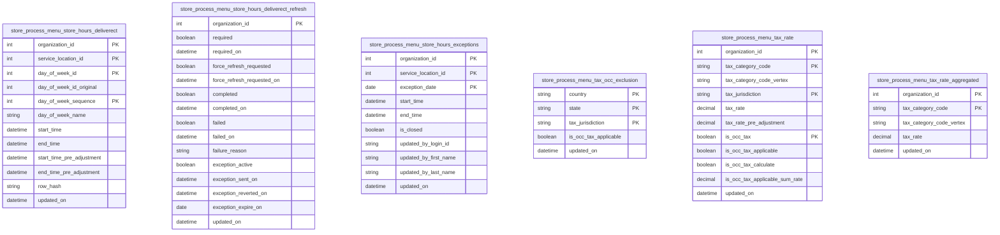

# menu-publisher - operations-audit-process 7

```mermaid
erDiagram
    store_process_menu_store_hours_deliverect {
        int organization_id PK
        int service_location_id PK
        int day_of_week_id PK
        int day_of_week_id_original
        int day_of_week_sequence PK
        string day_of_week_name
        datetime start_time
        datetime end_time
        datetime start_time_pre_adjustment
        datetime end_time_pre_adjustment
        string row_hash
        datetime updated_on
    }
    store_process_menu_store_hours_deliverect_refresh {
        int organization_id PK
        boolean required
        datetime required_on
        boolean force_refresh_requested
        datetime force_refresh_requested_on
        boolean completed
        datetime completed_on
        boolean failed
        datetime failed_on
        string failure_reason
        boolean exception_active
        datetime exception_sent_on
        datetime exception_reverted_on
        date exception_expire_on
        datetime updated_on
    }
    store_process_menu_store_hours_exceptions {
        int organization_id PK
        int service_location_id PK
        date exception_date PK
        datetime start_time
        datetime end_time
        boolean is_closed
        string updated_by_login_id
        string updated_by_first_name
        string updated_by_last_name
        datetime updated_on
    }
    store_process_menu_tax_occ_exclusion {
        string country PK
        string state PK
        string tax_jurisdiction PK
        boolean is_occ_tax_applicable
        datetime updated_on
    }
    store_process_menu_tax_rate {
        int organization_id PK
        string tax_category_code PK
        string tax_category_code_vertex
        string tax_jurisdiction PK
        decimal tax_rate
        decimal tax_rate_pre_adjustment
        boolean is_occ_tax PK
        boolean is_occ_tax_applicable
        boolean is_occ_tax_calculate
        decimal is_occ_tax_applicable_sum_rate
        datetime updated_on
    }
    store_process_menu_tax_rate_aggregated {
        int organization_id PK
        string tax_category_code PK
        string tax_category_code_vertex
        decimal tax_rate
        datetime updated_on
    }
```
