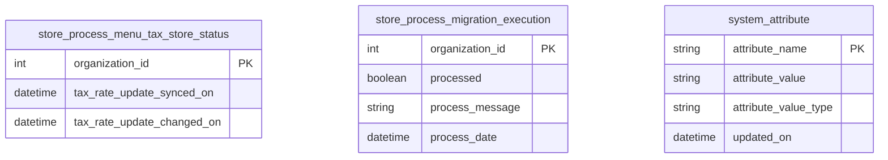

# menu-publisher - operations-audit-process 8

```mermaid
erDiagram
    store_process_menu_tax_store_status {
        int organization_id PK
        datetime tax_rate_update_synced_on
        datetime tax_rate_update_changed_on
    }
    store_process_migration_execution {
        int organization_id PK
        boolean processed
        string process_message
        datetime process_date
    }
    system_attribute {
        string attribute_name PK
        string attribute_value
        string attribute_value_type
        datetime updated_on
    }
```
