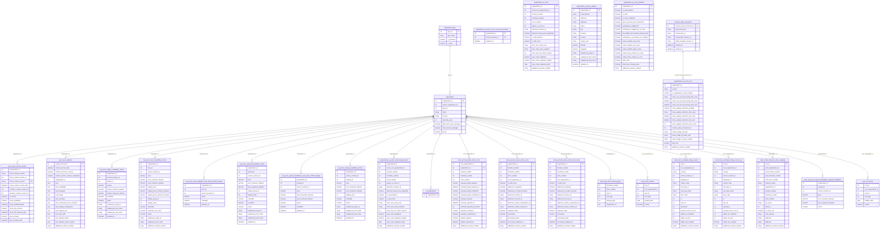

# menu-publisher - organization 1

```mermaid
erDiagram
    common_data_connection {
        int common_data_connection_id PK
        string write_bucket_url
        string read_bucket_url
        string read_bucket_archive_url
        string jobaid_template_bucket_url
        datetime created_on
        datetime updated_on
    }
    json_menu_content_version {
        int organization_id
        string menu_schema_version
        int menu_content_version_id
        string menu_content_version PK
        datetime menu_content_version_date
        int common_content_version_id
        int dynamic_content_version_id
        boolean is_current
        boolean azure_published
        datetime azure_published_date
        boolean azure_file_archived
        datetime azure_file_archived_date
        boolean json_archived
        datetime json_archived_date
    }
    json_menu_dynamic {
        int content_version_id PK
        datetime content_version_date
        boolean content_version_is_current
        boolean content_version_creation_completed
        int organization_id
        json item
        json item_availability
        json item_language
        json item_image
        json item_schedule
        json item_command_screen_schedule
        json item_topping_configuration
        json item_topping_size
        json item_auto_add
        json item_allowed_addon
        json item_allowed_custom_option
        string additional_columns_omitted
    }
    org_menu_addon_availability_restore {
        int organization_id
        int service_location_id
        int addon_id
        decimal charge
        decimal charge_minimum_allowed
        decimal charge_maximum_allowed
        boolean orderable
        boolean active
        string updated_by_login_id
        string updated_by_first_name
        string updated_by_last_name
        datetime updated_on
    }
    org_menu_item_availability_restore {
        int organization_id
        int item_id
        int service_location_id
        decimal price
        decimal price_minimum_allowed
        decimal price_maximum_allowed
        decimal topping_price
        decimal topping_price_minimum_allowed
        decimal topping_price_maximum_allowed
        int display_group_id
        int display_order
        boolean orderable
        boolean orderable_with_other
        boolean active
        string updated_by_login_id
        string updated_by_first_name
        string additional_columns_omitted
    }
    org_menu_item_availability_work_temp_427525_backup {
        int organization_id
        int item_id
        int service_location_id
        boolean active
        boolean orderable
        datetime updated_on
    }
    org_menu_special_availability_restore {
        int organization_id
        int special_id
        int service_location_id
        decimal price
        decimal price_minimum_allowed
        decimal price_maximum_allowed
        int display_group_id
        int display_order
        boolean orderable
        boolean is_hidden
        boolean active
        string updated_by_login_id
        string updated_by_first_name
        string updated_by_last_name
        datetime updated_on
    }
    org_menu_special_availability_work_temp_427525_backup {
        int organization_id
        int special_id
        int service_location_id
        decimal price
        decimal price_maximum_allowed
        decimal price_minimum_allowed
        boolean active
        boolean orderable
        datetime updated_on
    }
    org_menu_topping_availability_restore {
        int organization_id
        int service_location_id
        int topping_id
        decimal price
        decimal price_minimum_allowed
        decimal price_maximum_allowed
        int display_order
        boolean orderable
        boolean active
        string updated_by_login_id
        string updated_by_first_name
        string updated_by_last_name
        datetime updated_on
    }
    organization {
        int organization_id PK
        int parent_organization_id
        int type_id
        string name
        string country
        int hierarchy_level
        boolean hide_from_menu_manager
        boolean fran_connect_managed
        boolean active
    }
    organization_as_menu_root {
        int organization_id PK
        string country
        boolean is_organization_country_default
        string menu_xref_root_processing_time_zone
        datetime menu_xref_root_processing_time_start
        datetime menu_xref_root_processing_time_end
        boolean menu_update_restriction_enabled
        string menu_update_restriction_time_zone
        datetime menu_update_restriction_time_start
        datetime menu_update_restriction_time_end
        int menu_update_restriction_store_count
        int common_data_connection_id
        string instore_image_url_base
        string online_image_url_base_web
        string online_image_url_base_mobile
        boolean dmb_root
        string additional_columns_omitted
    }
    organization_as_menu_root_xref_service_location {
        int organization_id PK
        int service_location_id PK
        datetime updated_on
    }
    organization_as_store {
        int organization_id PK
        int menu_root_organization_id
        int location_number
        int franchise_number
        int store_number
        int legacy_cv_store_id
        string deliverect_location_id
        boolean deliverect_base_price_applicable
        boolean is_load_balance
        boolean is_fake_store
        string time_zone_name_unix
        string time_zone_name_windows
        int time_zone_utc_offset_minutes
        boolean ngcv_menu_migrated
        boolean ngcv_menu_migration_staged
        date ngcv_menu_migration_date
        string additional_columns_omitted
    }
    organization_as_store_address {
        int organization_id PK
        string main_division
        string address1
        string address2
        string phone
        string city
        string province
        string country
        string postal_code
        decimal latitude
        decimal longitude
        string updated_by_login_id
        string updated_by_first_name
        string updated_by_last_name
        datetime updated_on
    }
    organization_as_store_attribute {
        int organization_id PK
        boolean is_load_balance
        boolean is_mike
        boolean is_none_traditional
        boolean ignore_promise_time_calculation
        boolean participate_in_digital_hnr
        boolean participate_in_digital_hnr_no_scan
        boolean hnr_digital_store_default_promise_time
        boolean participate_in_secondary_tax_category
        boolean instore_publish_raw_menu
        boolean online_publish_new_menu
        boolean online_publish_legacy_menu
        boolean online_show_calories_on_menu
        boolean online_show_calories_on_cart
        boolean dmb_store
        boolean dmb_drive_through_store
        string additional_columns_omitted
    }
    organization_as_store_load_testing_stores {
        int organization_id
        int menu_root_organization_id
        int location_number
        int franchise_number
        int store_number
        int legacy_cv_store_id
        string deliverect_location_id
        boolean deliverect_base_price_applicable
        boolean is_load_balance
        boolean is_fake_store
        string time_zone_name_unix
        string time_zone_name_windows
        int time_zone_utc_offset_minutes
        boolean ngcv_menu_migrated
        boolean ngcv_menu_migration_staged
        date ngcv_menu_migration_date
        string additional_columns_omitted
    }
    organization_type {
        int type_id PK
        string type_name
        boolean is_franchise
        boolean is_store
    }
    p_organizations {
        int organization_id
    }
    store_process_dmb_action_store {
        int root_organization_id
        int organization_id PK
        int location_number
        int franchise_number
        int store_number
        boolean evaluate_partial_required
        datetime evaluate_partial_required_on
        boolean evaluate_partial_completed
        datetime evaluate_partial_completed_on
        boolean evaluate_required
        datetime evaluate_required_on
        int evaluate_required_processes
        boolean evaluate_completed
        datetime evaluate_completed_on
        boolean publish_required
        datetime publish_required_on
        string additional_columns_omitted
    }
    store_process_menu_action_store {
        int organization_id PK
        int location_number
        int franchise_number
        int store_number
        int root_organization_id
        boolean is_fake_store
        boolean deliverect_integrated
        boolean deliverect_is_master_location
        string deliverect_location_id
        string deliverect_account_id
        int deliverect_master_organization_id
        string deliverect_master_location_id
        boolean migrated_today
        boolean processing
        int processing_order
        datetime processing_updated_on
        string additional_columns_omitted
    }
    store_process_menu_action_store_temp {
        int organization_id PK
        int location_number
        int franchise_number
        int store_number
        int root_organization_id
        boolean is_fake_store
        boolean deliverect_integrated
        boolean deliverect_is_master_location
        string deliverect_location_id
        string deliverect_account_id
        int deliverect_master_organization_id
        string deliverect_master_location_id
        boolean migrated_today
        boolean processing
        int processing_order
        datetime processing_updated_on
        string additional_columns_omitted
    }
    temp_dmb_store_warning_types {
        int franchise_number
        int store_number
        int xref_id
        int xref_type
        int warning_type
        int organization_id
    }
    temp_work_archive {
        int row_id
        int root_organization_id
        int xref_id
        int xref_type
        date disable_date
        boolean archive
    }
    work_menu_redesign_image_source {
        int row_id
        int root_organization_id
        string country
        int service_location_id
        int language_id
        string culture_code
        int xref_type_id
        string xref_type_name
        string item_code
        int id
        int item_id
        int special_id
        int special_source_row_id
        int addon_id_combined
        int addon_id_only
        boolean addon_id_is_default
        string additional_columns_omitted
    }
    work_menu_redesign_image_source_qa {
        int row_id
        int root_organization_id
        string country
        int service_location_id
        int language_id
        string culture_code
        int xref_type_id
        string xref_type_name
        string item_code
        int id
        int item_id
        int special_id
        int special_source_row_id
        int addon_id_combined
        int addon_id_only
        boolean addon_id_is_default
        string additional_columns_omitted
    }
    work_online_load_test_store_mapping {
        int row_id PK
        int prod_organization_id
        int prod_location_number
        int prod_franchise_number
        int prod_store_number
        string prod_file_name
        int organization_id
        int location_number
        int franchise_number
        int store_number
        string file_name
        int block_id
        boolean is_vertex_set
        string main_division
        string address1
        string address2
        string additional_columns_omitted
    }
    work_org_menu_special_availability_snapshot_20260515 {
        int organization_id
        int special_id
        int service_location_id
        decimal price
        decimal price_minimum_allowed
        decimal price_maximum_allowed
        boolean active
    }
    work_us_archive {
        int row_id
        int root_organization_id
        int xref_id
        int xref_type
        date disable_date
        boolean archive
    }
    common_data_connection ||--o{ organization_as_menu_root : common_data_connection_id
    organization ||--o{ json_menu_content_version : organization_id
    organization ||--o{ json_menu_dynamic : organization_id
    organization ||--o{ org_menu_addon_availability_restore : organization_id
    organization ||--o{ org_menu_item_availability_restore : organization_id
    organization ||--o{ org_menu_item_availability_work_temp_427525_backup : organization_id
    organization ||--o{ org_menu_special_availability_restore : organization_id
    organization ||--o{ org_menu_special_availability_work_temp_427525_backup : organization_id
    organization ||--o{ org_menu_topping_availability_restore : organization_id
    organization ||--o{ organization_as_store_load_testing_stores : organization_id
    organization ||--o{ p_organizations : organization_id
    organization ||--o{ store_process_dmb_action_store : root_organization_id
    organization ||--o{ store_process_menu_action_store : root_organization_id
    organization ||--o{ store_process_menu_action_store_temp : root_organization_id
    organization ||--o{ temp_dmb_store_warning_types : organization_id
    organization ||--o{ temp_work_archive : root_organization_id
    organization ||--o{ work_menu_redesign_image_source : root_organization_id
    organization ||--o{ work_menu_redesign_image_source_qa : root_organization_id
    organization ||--o{ work_online_load_test_store_mapping : organization_id
    organization ||--o{ work_org_menu_special_availability_snapshot_20260515 : organization_id
    organization ||--o{ work_us_archive : root_organization_id
    organization_type ||--o{ organization : type_id
```
