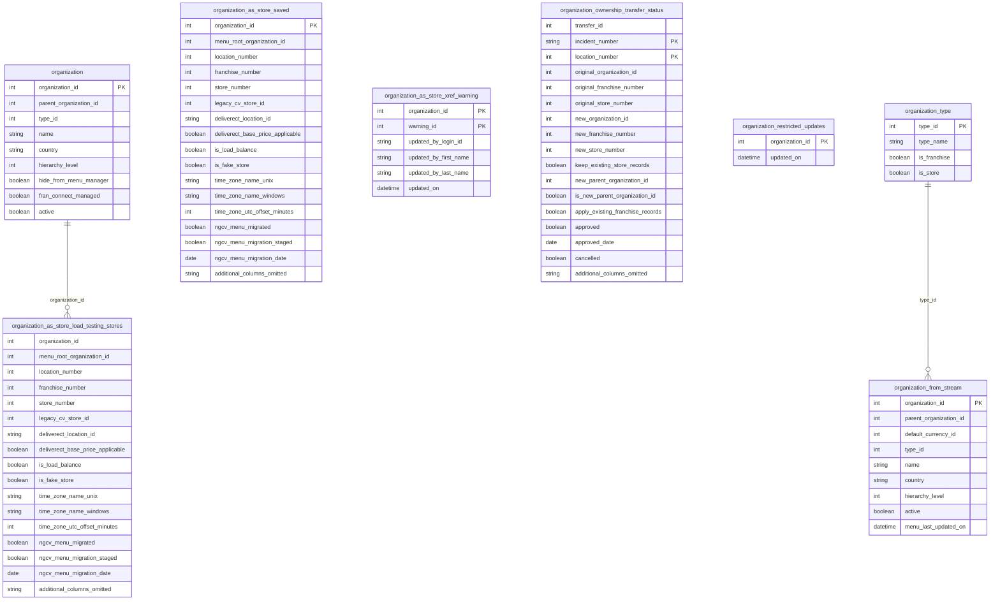

# menu-publisher - organization 2

```mermaid
erDiagram
    organization {
        int organization_id PK
        int parent_organization_id
        int type_id
        string name
        string country
        int hierarchy_level
        boolean hide_from_menu_manager
        boolean fran_connect_managed
        boolean active
    }
    organization_as_store_load_testing_stores {
        int organization_id
        int menu_root_organization_id
        int location_number
        int franchise_number
        int store_number
        int legacy_cv_store_id
        string deliverect_location_id
        boolean deliverect_base_price_applicable
        boolean is_load_balance
        boolean is_fake_store
        string time_zone_name_unix
        string time_zone_name_windows
        int time_zone_utc_offset_minutes
        boolean ngcv_menu_migrated
        boolean ngcv_menu_migration_staged
        date ngcv_menu_migration_date
        string additional_columns_omitted
    }
    organization_as_store_saved {
        int organization_id PK
        int menu_root_organization_id
        int location_number
        int franchise_number
        int store_number
        int legacy_cv_store_id
        string deliverect_location_id
        boolean deliverect_base_price_applicable
        boolean is_load_balance
        boolean is_fake_store
        string time_zone_name_unix
        string time_zone_name_windows
        int time_zone_utc_offset_minutes
        boolean ngcv_menu_migrated
        boolean ngcv_menu_migration_staged
        date ngcv_menu_migration_date
        string additional_columns_omitted
    }
    organization_as_store_xref_warning {
        int organization_id PK
        int warning_id PK
        string updated_by_login_id
        string updated_by_first_name
        string updated_by_last_name
        datetime updated_on
    }
    organization_from_stream {
        int organization_id PK
        int parent_organization_id
        int default_currency_id
        int type_id
        string name
        string country
        int hierarchy_level
        boolean active
        datetime menu_last_updated_on
    }
    organization_ownership_transfer_status {
        int transfer_id
        string incident_number PK
        int location_number PK
        int original_organization_id
        int original_franchise_number
        int original_store_number
        int new_organization_id
        int new_franchise_number
        int new_store_number
        boolean keep_existing_store_records
        int new_parent_organization_id
        boolean is_new_parent_organization_id
        boolean apply_existing_franchise_records
        boolean approved
        date approved_date
        boolean cancelled
        string additional_columns_omitted
    }
    organization_restricted_updates {
        int organization_id PK
        datetime updated_on
    }
    organization_type {
        int type_id PK
        string type_name
        boolean is_franchise
        boolean is_store
    }
    organization ||--o{ organization_as_store_load_testing_stores : organization_id
    organization_type ||--o{ organization_from_stream : type_id
```
