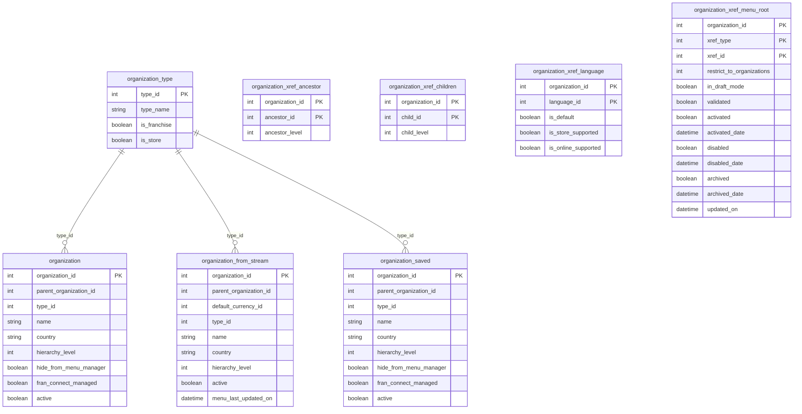

# menu-publisher - organization 3

```mermaid
erDiagram
    organization {
        int organization_id PK
        int parent_organization_id
        int type_id
        string name
        string country
        int hierarchy_level
        boolean hide_from_menu_manager
        boolean fran_connect_managed
        boolean active
    }
    organization_from_stream {
        int organization_id PK
        int parent_organization_id
        int default_currency_id
        int type_id
        string name
        string country
        int hierarchy_level
        boolean active
        datetime menu_last_updated_on
    }
    organization_saved {
        int organization_id PK
        int parent_organization_id
        int type_id
        string name
        string country
        int hierarchy_level
        boolean hide_from_menu_manager
        boolean fran_connect_managed
        boolean active
    }
    organization_type {
        int type_id PK
        string type_name
        boolean is_franchise
        boolean is_store
    }
    organization_xref_ancestor {
        int organization_id PK
        int ancestor_id PK
        int ancestor_level
    }
    organization_xref_children {
        int organization_id PK
        int child_id PK
        int child_level
    }
    organization_xref_language {
        int organization_id PK
        int language_id PK
        boolean is_default
        boolean is_store_supported
        boolean is_online_supported
    }
    organization_xref_menu_root {
        int organization_id PK
        int xref_type PK
        int xref_id PK
        int restrict_to_organizations
        boolean in_draft_mode
        boolean validated
        boolean activated
        datetime activated_date
        boolean disabled
        datetime disabled_date
        boolean archived
        datetime archived_date
        datetime updated_on
    }
    organization_type ||--o{ organization : type_id
    organization_type ||--o{ organization_from_stream : type_id
    organization_type ||--o{ organization_saved : type_id
```
