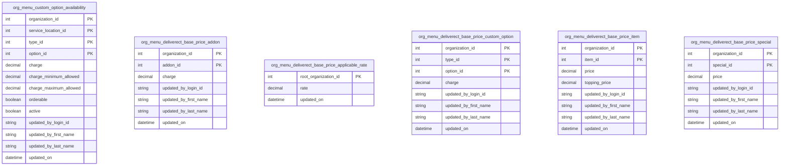

# menu-publisher - organization-menu-overrides 2

```mermaid
erDiagram
    org_menu_custom_option_availability {
        int organization_id PK
        int service_location_id PK
        int type_id PK
        int option_id PK
        decimal charge
        decimal charge_minimum_allowed
        decimal charge_maximum_allowed
        boolean orderable
        boolean active
        string updated_by_login_id
        string updated_by_first_name
        string updated_by_last_name
        datetime updated_on
    }
    org_menu_deliverect_base_price_addon {
        int organization_id PK
        int addon_id PK
        decimal charge
        string updated_by_login_id
        string updated_by_first_name
        string updated_by_last_name
        datetime updated_on
    }
    org_menu_deliverect_base_price_applicable_rate {
        int root_organization_id PK
        decimal rate
        datetime updated_on
    }
    org_menu_deliverect_base_price_custom_option {
        int organization_id PK
        int type_id PK
        int option_id PK
        decimal charge
        string updated_by_login_id
        string updated_by_first_name
        string updated_by_last_name
        datetime updated_on
    }
    org_menu_deliverect_base_price_item {
        int organization_id PK
        int item_id PK
        decimal price
        decimal topping_price
        string updated_by_login_id
        string updated_by_first_name
        string updated_by_last_name
        datetime updated_on
    }
    org_menu_deliverect_base_price_special {
        int organization_id PK
        int special_id PK
        decimal price
        string updated_by_login_id
        string updated_by_first_name
        string updated_by_last_name
        datetime updated_on
    }
```
