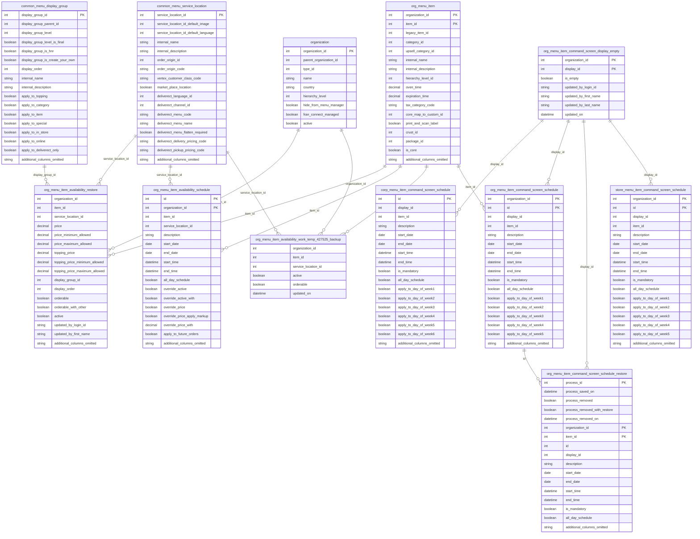

# menu-publisher - organization-menu-overrides 4

```mermaid
erDiagram
    common_menu_display_group {
        int display_group_id PK
        int display_group_parent_id
        int display_group_level
        boolean display_group_level_is_final
        boolean display_group_is_hnr
        boolean display_group_is_create_your_own
        int display_order
        string internal_name
        string internal_description
        boolean apply_to_topping
        boolean apply_to_category
        boolean apply_to_item
        boolean apply_to_special
        boolean apply_to_in_store
        boolean apply_to_online
        boolean apply_to_deliverect_only
        string additional_columns_omitted
    }
    common_menu_service_location {
        int service_location_id PK
        int service_location_id_default_image
        int service_location_id_default_language
        string internal_name
        string internal_description
        int order_origin_id
        string order_origin_code
        string vertex_customer_class_code
        boolean market_place_location
        int deliverect_language_id
        int deliverect_channel_id
        string deliverect_menu_code
        string deliverect_menu_name
        boolean deliverect_menu_flatten_required
        string deliverect_delivery_pricing_code
        string deliverect_pickup_pricing_code
        string additional_columns_omitted
    }
    corp_menu_item_command_screen_schedule {
        int id PK
        int display_id
        int item_id
        string description
        date start_date
        date end_date
        datetime start_time
        datetime end_time
        boolean is_mandatory
        boolean all_day_schedule
        boolean apply_to_day_of_week1
        boolean apply_to_day_of_week2
        boolean apply_to_day_of_week3
        boolean apply_to_day_of_week4
        boolean apply_to_day_of_week5
        boolean apply_to_day_of_week6
        string additional_columns_omitted
    }
    org_menu_item {
        int organization_id PK
        int item_id PK
        int legacy_item_id
        int category_id
        int upsell_category_id
        string internal_name
        string internal_description
        int hierarchy_level_id
        decimal oven_time
        decimal expiration_time
        string tax_category_code
        int core_map_to_custom_id
        boolean print_and_scan_label
        int crust_id
        int package_id
        boolean is_core
        string additional_columns_omitted
    }
    org_menu_item_availability_restore {
        int organization_id
        int item_id
        int service_location_id
        decimal price
        decimal price_minimum_allowed
        decimal price_maximum_allowed
        decimal topping_price
        decimal topping_price_minimum_allowed
        decimal topping_price_maximum_allowed
        int display_group_id
        int display_order
        boolean orderable
        boolean orderable_with_other
        boolean active
        string updated_by_login_id
        string updated_by_first_name
        string additional_columns_omitted
    }
    org_menu_item_availability_schedule {
        int id PK
        int organization_id PK
        int item_id
        int service_location_id
        string description
        date start_date
        date end_date
        datetime start_time
        datetime end_time
        boolean all_day_schedule
        boolean override_active
        boolean override_active_with
        boolean override_price
        boolean override_price_apply_markup
        decimal override_price_with
        boolean apply_to_future_orders
        string additional_columns_omitted
    }
    org_menu_item_availability_work_temp_427525_backup {
        int organization_id
        int item_id
        int service_location_id
        boolean active
        boolean orderable
        datetime updated_on
    }
    org_menu_item_command_screen_display_empty {
        int organization_id PK
        int display_id PK
        boolean is_empty
        string updated_by_login_id
        string updated_by_first_name
        string updated_by_last_name
        datetime updated_on
    }
    org_menu_item_command_screen_schedule {
        int organization_id PK
        int id PK
        int display_id
        int item_id
        string description
        date start_date
        date end_date
        datetime start_time
        datetime end_time
        boolean is_mandatory
        boolean all_day_schedule
        boolean apply_to_day_of_week1
        boolean apply_to_day_of_week2
        boolean apply_to_day_of_week3
        boolean apply_to_day_of_week4
        boolean apply_to_day_of_week5
        string additional_columns_omitted
    }
    org_menu_item_command_screen_schedule_restore {
        int process_id PK
        datetime process_saved_on
        boolean process_removed
        boolean process_removed_with_restore
        datetime process_removed_on
        int organization_id PK
        int item_id PK
        int id
        int display_id
        string description
        date start_date
        date end_date
        datetime start_time
        datetime end_time
        boolean is_mandatory
        boolean all_day_schedule
        string additional_columns_omitted
    }
    organization {
        int organization_id PK
        int parent_organization_id
        int type_id
        string name
        string country
        int hierarchy_level
        boolean hide_from_menu_manager
        boolean fran_connect_managed
        boolean active
    }
    store_menu_item_command_screen_schedule {
        int organization_id PK
        int id PK
        int display_id
        int item_id
        string description
        date start_date
        date end_date
        datetime start_time
        datetime end_time
        boolean is_mandatory
        boolean all_day_schedule
        boolean apply_to_day_of_week1
        boolean apply_to_day_of_week2
        boolean apply_to_day_of_week3
        boolean apply_to_day_of_week4
        boolean apply_to_day_of_week5
        string additional_columns_omitted
    }
    common_menu_display_group ||--o{ org_menu_item_availability_restore : display_group_id
    common_menu_service_location ||--o{ org_menu_item_availability_restore : service_location_id
    common_menu_service_location ||--o{ org_menu_item_availability_schedule : service_location_id
    common_menu_service_location ||--o{ org_menu_item_availability_work_temp_427525_backup : service_location_id
    org_menu_item ||--o{ org_menu_item_availability_restore : item_id
    org_menu_item ||--o{ org_menu_item_availability_schedule : item_id
    org_menu_item ||--o{ org_menu_item_availability_work_temp_427525_backup : item_id
    org_menu_item ||--o{ org_menu_item_command_screen_schedule : item_id
    org_menu_item_command_screen_display_empty ||--o{ corp_menu_item_command_screen_schedule : display_id
    org_menu_item_command_screen_display_empty ||--o{ org_menu_item_command_screen_schedule : display_id
    org_menu_item_command_screen_display_empty ||--o{ org_menu_item_command_screen_schedule_restore : display_id
    org_menu_item_command_screen_display_empty ||--o{ store_menu_item_command_screen_schedule : display_id
    org_menu_item_command_screen_schedule ||--o{ org_menu_item_command_screen_schedule_restore : id
    organization ||--o{ org_menu_item_availability_restore : organization_id
    organization ||--o{ org_menu_item_availability_work_temp_427525_backup : organization_id
```
