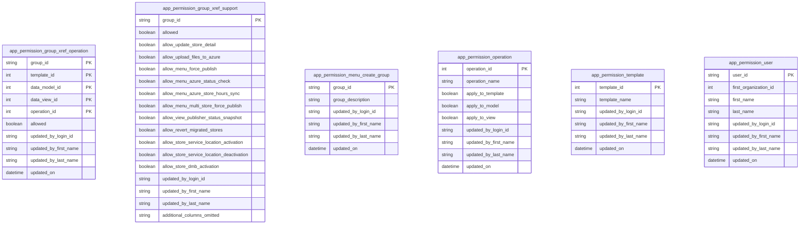

# menu-publisher - permissions 2

```mermaid
erDiagram
    app_permission_group_xref_operation {
        string group_id PK
        int template_id PK
        int data_model_id PK
        int data_view_id PK
        int operation_id PK
        boolean allowed
        string updated_by_login_id
        string updated_by_first_name
        string updated_by_last_name
        datetime updated_on
    }
    app_permission_group_xref_support {
        string group_id PK
        boolean allowed
        boolean allow_update_store_detail
        boolean allow_upload_files_to_azure
        boolean allow_menu_force_publish
        boolean allow_menu_azure_status_check
        boolean allow_menu_azure_store_hours_sync
        boolean allow_menu_multi_store_force_publish
        boolean allow_view_publisher_status_snapshot
        boolean allow_revert_migrated_stores
        boolean allow_store_service_location_activation
        boolean allow_store_service_location_deactivation
        boolean allow_store_dmb_activation
        string updated_by_login_id
        string updated_by_first_name
        string updated_by_last_name
        string additional_columns_omitted
    }
    app_permission_menu_create_group {
        string group_id PK
        string group_description
        string updated_by_login_id
        string updated_by_first_name
        string updated_by_last_name
        datetime updated_on
    }
    app_permission_operation {
        int operation_id PK
        string operation_name
        boolean apply_to_template
        boolean apply_to_model
        boolean apply_to_view
        string updated_by_login_id
        string updated_by_first_name
        string updated_by_last_name
        datetime updated_on
    }
    app_permission_template {
        int template_id PK
        string template_name
        string updated_by_login_id
        string updated_by_first_name
        string updated_by_last_name
        datetime updated_on
    }
    app_permission_user {
        string user_id PK
        int first_organization_id
        string first_name
        string last_name
        string updated_by_login_id
        string updated_by_first_name
        string updated_by_last_name
        datetime updated_on
    }
```
