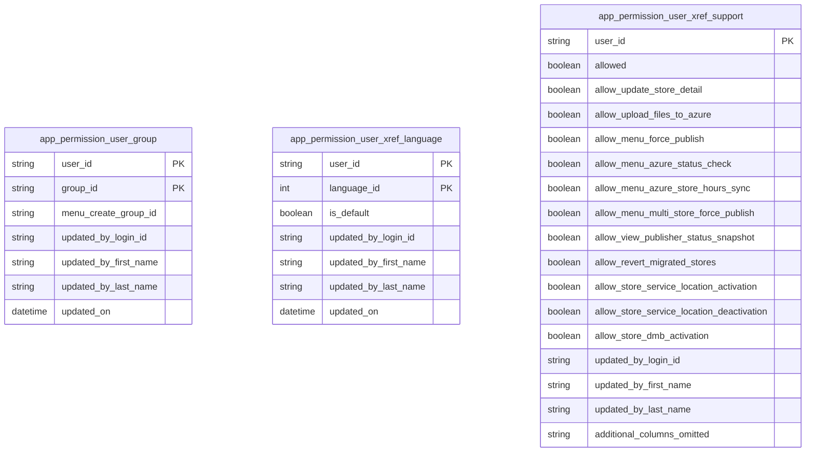

# menu-publisher - permissions 3

```mermaid
erDiagram
    app_permission_user_group {
        string user_id PK
        string group_id PK
        string menu_create_group_id
        string updated_by_login_id
        string updated_by_first_name
        string updated_by_last_name
        datetime updated_on
    }
    app_permission_user_xref_language {
        string user_id PK
        int language_id PK
        boolean is_default
        string updated_by_login_id
        string updated_by_first_name
        string updated_by_last_name
        datetime updated_on
    }
    app_permission_user_xref_support {
        string user_id PK
        boolean allowed
        boolean allow_update_store_detail
        boolean allow_upload_files_to_azure
        boolean allow_menu_force_publish
        boolean allow_menu_azure_status_check
        boolean allow_menu_azure_store_hours_sync
        boolean allow_menu_multi_store_force_publish
        boolean allow_view_publisher_status_snapshot
        boolean allow_revert_migrated_stores
        boolean allow_store_service_location_activation
        boolean allow_store_service_location_deactivation
        boolean allow_store_dmb_activation
        string updated_by_login_id
        string updated_by_first_name
        string updated_by_last_name
        string additional_columns_omitted
    }
```
