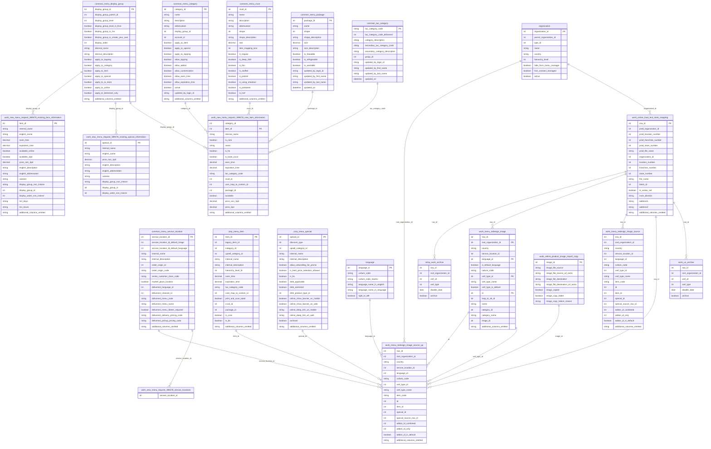

# menu-publisher - work-temp 2

```mermaid
erDiagram
    common_menu_category {
        int category_id PK
        string name
        string description
        string abbreviation
        int display_group_id
        int account_id
        boolean apply_to_item
        boolean apply_to_special
        boolean apply_to_topping
        boolean allow_topping
        boolean allow_addon
        boolean allow_customization
        boolean allow_oven_time
        boolean allow_expiration_time
        boolean active
        string updated_by_login_id
        string additional_columns_omitted
    }
    common_menu_crust {
        int crust_id PK
        string name
        string description
        string abbreviation
        int shape
        string shape_description
        decimal size
        int item_mapping_size
        boolean is_regular
        boolean is_deep_dish
        boolean is_thin
        boolean is_stuffed
        boolean is_pretzel
        boolean is_using_sheetout
        boolean is_parbaked
        boolean is_half
        string additional_columns_omitted
    }
    common_menu_display_group {
        int display_group_id PK
        int display_group_parent_id
        int display_group_level
        boolean display_group_level_is_final
        boolean display_group_is_hnr
        boolean display_group_is_create_your_own
        int display_order
        string internal_name
        string internal_description
        boolean apply_to_topping
        boolean apply_to_category
        boolean apply_to_item
        boolean apply_to_special
        boolean apply_to_in_store
        boolean apply_to_online
        boolean apply_to_deliverect_only
        string additional_columns_omitted
    }
    common_menu_package {
        int package_id PK
        string name
        int shape
        string shape_description
        decimal size
        string size_description
        boolean is_heatable
        boolean is_refrigerable
        boolean is_wastable
        string updated_by_login_id
        string updated_by_first_name
        string updated_by_last_name
        datetime updated_on
    }
    common_menu_service_location {
        int service_location_id PK
        int service_location_id_default_image
        int service_location_id_default_language
        string internal_name
        string internal_description
        int order_origin_id
        string order_origin_code
        string vertex_customer_class_code
        boolean market_place_location
        int deliverect_language_id
        int deliverect_channel_id
        string deliverect_menu_code
        string deliverect_menu_name
        boolean deliverect_menu_flatten_required
        string deliverect_delivery_pricing_code
        string deliverect_pickup_pricing_code
        string additional_columns_omitted
    }
    common_tax_category {
        string tax_category_code PK
        int tax_category_code_deliverect
        string category_description
        string secondary_tax_category_code
        string secondary_category_description
        int group_id
        string updated_by_login_id
        string updated_by_first_name
        string updated_by_last_name
        datetime updated_on
    }
    corp_menu_item {
        int item_id PK
        int legacy_item_id
        int category_id
        int upsell_category_id
        string internal_name
        string internal_description
        int hierarchy_level_id
        decimal oven_time
        decimal expiration_time
        string tax_category_code
        int core_map_to_custom_id
        boolean print_and_scan_label
        int crust_id
        int package_id
        boolean is_core
        boolean is_lto
        string additional_columns_omitted
    }
    corp_menu_special {
        int special_id PK
        int discount_type
        int upsell_category_id
        string internal_name
        string internal_description
        boolean allow_unbundling_for_promo
        boolean is_best_price_selection_allowed
        boolean is_lto
        boolean dmb_applicable
        boolean dmb_restricted
        int dmb_product_type_id
        boolean online_show_banner_on_mobile
        boolean online_show_banner_on_web
        string online_deep_link_url_mobile
        string online_deep_link_url_web
        boolean archived
        string additional_columns_omitted
    }
    language {
        int language_id PK
        string culture_code
        string culture_code_neutral
        string language_name_in_english
        string language_name_in_language
        boolean right_to_left
    }
    organization {
        int organization_id PK
        int parent_organization_id
        int type_id
        string name
        string country
        int hierarchy_level
        boolean hide_from_menu_manager
        boolean fran_connect_managed
        boolean active
    }
    temp_work_archive {
        int row_id
        int root_organization_id
        int xref_id
        int xref_type
        date disable_date
        boolean archive
    }
    work_menu_redesign_image {
        int row_id
        int root_organization_id PK
        string country
        int service_location_id
        int language_id PK
        boolean is_default_language
        string culture_code
        int xref_type_id PK
        string xref_type_name
        boolean xref_type_is_default
        int id PK
        int map_to_alt_id
        string name
        int category_id
        string category_name
        int image_id
        string additional_columns_omitted
    }
    work_menu_redesign_image_source {
        int row_id
        int root_organization_id
        string country
        int service_location_id
        int language_id
        string culture_code
        int xref_type_id
        string xref_type_name
        string item_code
        int id
        int item_id
        int special_id
        int special_source_row_id
        int addon_id_combined
        int addon_id_only
        boolean addon_id_is_default
        string additional_columns_omitted
    }
    work_menu_redesign_image_source_qa {
        int row_id
        int root_organization_id
        string country
        int service_location_id
        int language_id
        string culture_code
        int xref_type_id
        string xref_type_name
        string item_code
        int id
        int item_id
        int special_id
        int special_source_row_id
        int addon_id_combined
        int addon_id_only
        boolean addon_id_is_default
        string additional_columns_omitted
    }
    work_new_menu_request_389478_existing_item_information {
        int item_id PK
        string internal_name
        string english_name
        decimal oven_time
        decimal expiration_time
        boolean available_online
        boolean available_3pd
        decimal price_non_3pd
        string english_description
        string english_abbreviation
        string calories
        string display_group_non_instore
        int display_group_id
        int display_order_non_instore
        string hnr_days
        string hnr_hours
        string additional_columns_omitted
    }
    work_new_menu_request_389478_existing_special_information {
        int special_id PK
        string internal_name
        string english_name
        decimal price_non_3pd
        string english_description
        string english_abbreviation
        string calories
        string display_group_non_instore
        int display_group_id
        int display_order_non_instore
    }
    work_new_menu_request_389478_new_item_information {
        int category_id
        int item_id PK
        string internal_name
        boolean is_core
        string name
        boolean is_lto
        boolean is_base_crust
        decimal oven_time
        decimal expiration_time
        string tax_category_code
        int crust_id
        int core_map_to_custom_id
        int package_id
        boolean available
        decimal price_non_3pd
        decimal price_3pd
        string additional_columns_omitted
    }
    work_new_menu_request_389478_service_locations {
        int service_location_id
    }
    work_online_load_test_store_mapping {
        int row_id PK
        int prod_organization_id
        int prod_location_number
        int prod_franchise_number
        int prod_store_number
        string prod_file_name
        int organization_id
        int location_number
        int franchise_number
        int store_number
        string file_name
        int block_id
        boolean is_vertex_set
        string main_division
        string address1
        string address2
        string additional_columns_omitted
    }
    work_online_product_image_import_copy {
        int image_id PK
        string image_file_source
        string image_file_source_url_extra
        string image_file_destination
        string image_file_destination_url_extra
        boolean image_copied
        boolean image_copy_failed
        string image_copy_failure_reason
    }
    work_us_archive {
        int row_id
        int root_organization_id
        int xref_id
        int xref_type
        date disable_date
        boolean archive
    }
    common_menu_category ||--o{ work_new_menu_request_389478_new_item_information : category_id
    common_menu_crust ||--o{ work_new_menu_request_389478_new_item_information : crust_id
    common_menu_display_group ||--o{ work_new_menu_request_389478_existing_item_information : display_group_id
    common_menu_display_group ||--o{ work_new_menu_request_389478_existing_special_information : display_group_id
    common_menu_display_group ||--o{ work_new_menu_request_389478_new_item_information : display_group_id
    common_menu_package ||--o{ work_new_menu_request_389478_new_item_information : package_id
    common_menu_service_location ||--o{ work_menu_redesign_image_source_qa : service_location_id
    common_menu_service_location ||--o{ work_new_menu_request_389478_service_locations : service_location_id
    common_tax_category ||--o{ work_new_menu_request_389478_new_item_information : tax_category_code
    corp_menu_item ||--o{ work_menu_redesign_image_source_qa : item_id
    corp_menu_special ||--o{ work_menu_redesign_image_source_qa : special_id
    language ||--o{ work_menu_redesign_image_source_qa : language_id
    organization ||--o{ work_menu_redesign_image_source_qa : root_organization_id
    organization ||--o{ work_online_load_test_store_mapping : organization_id
    work_menu_redesign_image ||--o{ work_menu_redesign_image_source_qa : id
    work_menu_redesign_image ||--o{ work_menu_redesign_image_source_qa : xref_type_id
    work_online_load_test_store_mapping ||--o{ temp_work_archive : row_id
    work_online_load_test_store_mapping ||--o{ work_menu_redesign_image : row_id
    work_online_load_test_store_mapping ||--o{ work_menu_redesign_image_source : row_id
    work_online_load_test_store_mapping ||--o{ work_menu_redesign_image_source_qa : row_id
    work_online_load_test_store_mapping ||--o{ work_us_archive : row_id
    work_online_product_image_import_copy ||--o{ work_menu_redesign_image_source_qa : image_id
```
