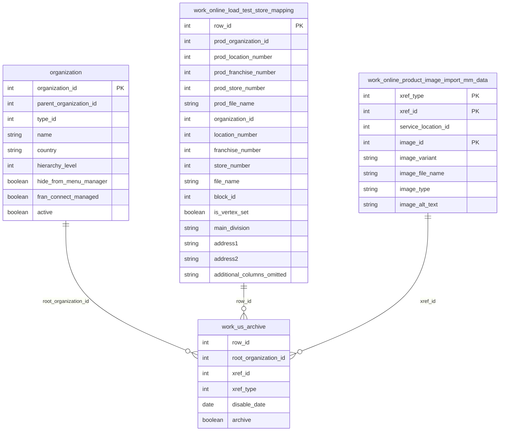

# menu-publisher - work-temp 5

```mermaid
erDiagram
    organization {
        int organization_id PK
        int parent_organization_id
        int type_id
        string name
        string country
        int hierarchy_level
        boolean hide_from_menu_manager
        boolean fran_connect_managed
        boolean active
    }
    work_online_load_test_store_mapping {
        int row_id PK
        int prod_organization_id
        int prod_location_number
        int prod_franchise_number
        int prod_store_number
        string prod_file_name
        int organization_id
        int location_number
        int franchise_number
        int store_number
        string file_name
        int block_id
        boolean is_vertex_set
        string main_division
        string address1
        string address2
        string additional_columns_omitted
    }
    work_online_product_image_import_mm_data {
        int xref_type PK
        int xref_id PK
        int service_location_id
        int image_id PK
        string image_variant
        string image_file_name
        string image_type
        string image_alt_text
    }
    work_us_archive {
        int row_id
        int root_organization_id
        int xref_id
        int xref_type
        date disable_date
        boolean archive
    }
    organization ||--o{ work_us_archive : root_organization_id
    work_online_load_test_store_mapping ||--o{ work_us_archive : row_id
    work_online_product_image_import_mm_data ||--o{ work_us_archive : xref_id
```
